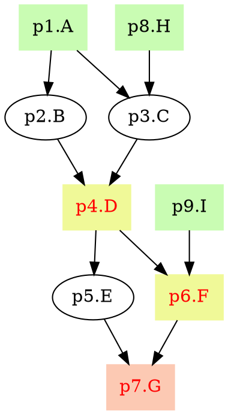

# pyppl - A python lightweight pipeline framework
![Pypi][22] ![Github][23] ![Gitbook][21]   

[Documentation][1] | [API][2] | [Change log][19] | [FAQ][26] | [Fork me][3]

<!-- toc -->
## Features
- [Easy-to-use command line parser.][27]
- [Fancy logs.][28]
- [Process caching.][6]
- [Script templating.][7]
- [Runner customization][9]
- [Error handling for processes.][12]
- [Easy-switching running profile.][13]
- Flowchat in [DOT][14] for your pipelines ([Details][15]).
- [Aggregations (a set of processes predefined).][16]
- Highly reusable processes (see [a set of highly reusable bioinformatics processes][24]).

## Requirements
- OS: Linux, OSX and WSL (Windows Subsystem for Linux)
- Python 2.7+ or Python 3.4+
- Python packages:
  - python-box
  - six
  - filelock

## Installation
```bash
# install latest version
git clone https://github.com/pwwang/PyPPL.git
cd PyPPL
python setup.py install
# or simly:
pip install git+git://github.com/pwwang/PyPPL.git

# install released version
pip install PyPPL
```

## Get started
See `tutorials/getStarted/`  
Sort 5 files simultaneously: 
```python
1. from pyppl import PyPPL, Proc, Channel

2. pSort         = Proc(desc = 'Sort files.')
3. pSort.input   = {"infile:file": Channel.fromPattern("./data/*.txt")}
4. pSort.output  = "outfile:file:{{in.infile | fn}}.sorted"
5. pSort.forks   = 5
6. pSort.exdir   = './export'
7. pSort.script  = """
  sort -k1r {{in.infile}} > {{out.outfile}} 
""" 

8. PyPPL().start(pSort).run()
```

**Line 1**: Import the modules.  
**Line 2**: Define the process with a description.  
**Line 3**: Define the input data for the process.  
**Line 4**: Define the output. Templates are also applied here.  
**Line 5**: Define how many jobs are running simultaneously.  
**Line 6**: Set the directory to export the output files.  
**Line 7**: Set your script to run.  
**Line 8**: Set the starting process and run the pipeline.  

![getStarted][20]
```
> ls -l ./export
total 0
-rw-rw-rw- 1 pwwang pwwang 44 Sep 14 20:50 test1.sorted
-rw-rw-rw- 1 pwwang pwwang 56 Sep 14 20:50 test2.sorted
-rw-rw-rw- 1 pwwang pwwang 59 Sep 14 20:50 test3.sorted
-rw-rw-rw- 1 pwwang pwwang 58 Sep 14 20:50 test4.sorted
-rw-rw-rw- 1 pwwang pwwang 58 Sep 14 20:50 test5.sorted
```

## Deduce input channel from dependent process
See `tutorials/inputFromDependent/`  
Sort 5 files and then add line number to each line.
```python
from pyppl import PyPPL, Proc, Channel

pSort        = Proc(desc = 'Sort files.')
pSort.input  = {"infile:file": Channel.fromPattern("./data/*.txt")}
pSort.output = "outfile:file:{{in.infile | fn}}.sorted"
pSort.forks  = 5
pSort.script = """
  sort -k1r {{in.infile}} > {{out.outfile}} 
""" 

pAddPrefix         = Proc(desc = 'Add line number to each line.')
pAddPrefix.depends = pSort
# automatically inferred from pSort.output
pAddPrefix.input   = "infile:file"  
pAddPrefix.output  = "outfile:file:{{in.infile | fn}}.ln"
pAddPrefix.exdir   = './export'
pAddPrefix.forks   = 5
pAddPrefix.script  = """
paste -d. <(seq 1 $(wc -l {{in.infile}} | cut -f1 -d' ')) {{in.infile}} > {{out.outfile}}
""" 

PyPPL().start(pSort).run()
```
```
> head -3 ./export/
1.8984
2.663
3.625
```

## Transform input channel
See `tutorials/transformInputChannels/`  
Sort 5 files, add line numbers, and merge them into one file.
```python
from pyppl import PyPPL, Proc, Channel

pSort        = Proc(desc = 'Sort files.')
pSort.input  = {"infile:file": Channel.fromPattern("./data/*.txt")}
pSort.output = "outfile:file:{{in.infile | fn}}.sorted"
pSort.forks  = 5
pSort.script = """
  sort -k1r {{in.infile}} > {{out.outfile}} 
""" 

pAddPrefix         = Proc(desc = 'Add line number to each line.')
pAddPrefix.depends = pSort
pAddPrefix.input   = "infile:file"  # automatically inferred from pSort.output
pAddPrefix.output  = "outfile:file:{{in.infile | fn}}.ln"
pAddPrefix.forks   = 5
pAddPrefix.script  = """
paste -d. <(seq 1 $(wc -l {{in.infile}} | cut -f1 -d' ')) {{in.infile}} > {{out.outfile}}
""" 

pMergeFiles         = Proc(desc = 'Merge files, each as a column.')
pMergeFiles.depends = pAddPrefix
# Transform it into a list of files
# ["test1.ln", "test2.ln", ..., "test5.ln"]
pMergeFiles.input   = {"infiles:files": lambda ch: [ch.flatten()]}
pMergeFiles.output  = "outfile:file:mergedfile.txt"
pMergeFiles.exdir   = "./export"
pMergeFiles.script  = """
paste {{in.infiles | asquote}} > {{out.outfile}}
"""

PyPPL().start(pSort).run()
```
```
> head -3 ./export/mergedfile.txt
1.8984  1.6448  1.2915  1.7269  1.7692
2.663   2.3369  2.26223 2.3866  2.7536
3.625   3.28984 3.25945 3.29971 3.30204
```

## Use a different language
See `tutorials/differentLang/`  
Plot heatmap using R.
```python
from pyppl import PyPPL, Proc

pHeatmap        = Proc(desc = 'Draw a heatmap.')
pHeatmap.input  = {'seed': 8525}
pHeatmap.output = "outfile:file:heatmap.png"
pHeatmap.exdir  = './export'
# Use full path "/path/to/Rscript" if it's not in $PATH
# You can also use a shebang in script
# in this case: #!/usr/bin/env Rscript
pHeatmap.lang   = 'Rscript' 
pHeatmap.script = """
set.seed({{in.seed}})
mat = matrix(rnorm(100), ncol=10)
png(filename = "{{out.outfile}}")
heatmap(mat)
dev.off()
"""

PyPPL().start(pHeatmap).run()
```
`./export/heatmap.png`  
![heatmap.png][29]

## Use args
```python
from pyppl import PyPPL, Proc

pHeatmap           = Proc(desc = 'Draw a heatmap.')
pHeatmap.input     = {'seed': [1,2,3]}
pHeatmap.output    = "outfile:file:heatmap{{in.seed}}.png"
pHeatmap.exdir     = "./export"
pHeatmap.forks     = 3
pHeatmap.args.ncol = 10
pHeatmap.args.nrow = 10
pHeatmap.lang      = 'Rscript' # or /path/to/Rscript if it's not in $PATH
pHeatmap.script = """
set.seed({{in.seed}})
mat = matrix(rnorm({{args.ncol, args.nrow | lambda x, y: x*y}}), ncol={{args.ncol}})
png(filename = "{{out.outfile}}", width=150, height=150)
heatmap(mat)
dev.off()
"""

PyPPL().start(pHeatmap).run()
```

|`./export/heatmap1.png`|`./export/heatmap2.png`|`./export/heatmap3.png`|
|-----------------------|-----------------------|-----------------------|
|  ![heatmap1.png][30]  |  ![heatmap2.png][31]  |  ![heatmap3.png][32]  |

## Use the command line argument parser
```python
from pyppl import PyPPL, Proc, Channel, params

params.datadir    \
  .setRequired()  \
  .setDesc('The data directory containing the data files.')

params = params.parse().toDict()

pSort         = Proc(desc = 'Sort files.')
pSort.input   = {"infile:file": Channel.fromPattern(params.datadir + '/*.txt')}
pSort.output  = "outfile:file:{{in.infile | fn}}.sorted"
pSort.forks   = 5
pSort.exdir   = './export'
pSort.script  = """
  sort -k1r {{in.infile}} > {{out.outfile}} 
""" 

PyPPL().start(pSort).run()

```
Run the pipeline: 
```
> python useParams.py
USAGE:
  useParams.py --param-datadir <str>

REQUIRED OPTIONS:
  --param-datadir <str>                 The data directory containing the data files.

OPTIONAL OPTIONS:
  -h, --help, -H, -?                    Print this help information.
```

## Using a different runner
```python
pPlot = proc()
pPlot.input   = {"infile:file": ["./data1.txt", "./data2.txt", "./data3.txt"]}
pPlot.output  = "outfile:file:{{infile.fn}}.png"
pPlot.lang    = "Rscript"
pPlot.runner  = "sge"
pPlot.sgeRunner = {
    "sgeRunner": {
      "sge.q" : "1-day"
    }		
}
# run all 5 jobs at the same time
pPlot.forks   = 5
pPlot.script  = """
data <- read.table ("{{infile}}")
H    <- hclust(dist(data))
png (figure = “{{outfile}}”)
plot(H)
dev.off()
"""
pyppl().starts(pPlot).run()
```

## Debug your script
```python
from pyppl import pyppl, proc
p = proc(tag = 'Debug')
p.input = {"a": [1]}
p.script = """
a={{a}}
echo "pyppl.log: The value of a is $a" 1>&2
a="someothervalue"
echo "pyppl.log.avalue: The value of a is $a" 1>&2
"""
```
You will get something like this in your log:
```
# other logs
[2017-01-01 01:01:01][    LOG] The value of a is 1
[2017-01-01 01:01:01][ AVALUE] The value of a is someothervalue
# other logs
```

## Use exported files as cache
```python
from pyppl import pyppl, proc

pDownload         = proc(desc = 'Download the genome reference.')
pDownload.input   = {"url": ["http://hgdownload.cse.ucsc.edu/goldenPath/hg19/bigZips/chromFa.tar.gz"]}
pDownload.output  = "outfile:file:hg19.tar.gz"
pDownload.exdir   = './export'
pDownload.cache   = 'export'
pDownload.script  = """
wget "{{url}}" -O "{{outfile}}"
""" 

pyppl().starts(pSort).run()
```
For this kind of process, you just want to run it only once. Next time when you run it, it will use the exported files in `pDownload.exdir` as output file and skip running the script.

## Dry-run a pipeline
If you just want to generate the pipeline flowchart or test the process settings, you would like to dry-run a pipeline, which will generate empty output files and directories and skip running the script.  
Dry runner is a built-in runner, so you just need to specify the runner name to the process:
```python
p.runner = 'dry'
```
To dry-run a whole pipeline:
```python
pyppl().starts().run('dry')
```

## Set expectations of a process output
```python
from pyppl import pyppl, proc

pDownload         = proc(desc = 'Download the genome reference.')
pDownload.input   = {"url": ["http://hgdownload.cse.ucsc.edu/goldenPath/hg19/bigZips/chromFa.tar.gz"]}
pDownload.output  = "outfile:file:hg19.tar.gz"
pDownload.exdir   = './export'
pDownload.cache   = 'export'
# Expect the outfile contains "chr"
pDownload.expect  = "grep chr {{outfile}}" 
pDownload.script  = """
wget "{{url}}" -O "{{outfile}}"
""" 

pyppl().starts(pSort).run()
```

## Switch runner profiles
In your configuration file: (i.e. `/path/to/mypyppl.json`)
```json
{
    "proc": {            // default profile
        "runner": "ssh",
        "sgeRunner": {
            // sge options
        }
    },
    "test" : {
        "forks": 1,
        "runner": "local"
    },
    "cluster": {
       "forks": 100,
       "runner": "sge",
       "sgeRunner": {
           "sge.q": "7-days",
           // ...
       }
    },
    "profile3": {...},
    ...
}
```

You can then switch them easily by:
```python
pyppl(cfile = "/path/to/mypyppl.json").starts(...).run('test')
# or
pyppl(cfile = "/path/to/mypyppl.json").starts(...).run('cluster')
```
You can use a command line option to control it by using the command line argument parser:
```python
from pyppl import pyppl, params

params.runner.setValue('test').setDesc("The running profile.")
params.parse()

# process definitions
# ...

pyppl(cfile = "/path/to/mypyppl.json").starts(...).run(params.runner.value)
```
Then to switch the runner:
```
> python pipeline.py --param-runner test
# or
> python pipeline.py --param-runner cluster
```

## Draw the pipeline chart
`pyppl` can generate the graph in [DOT language][14]. 
```python
# "A" is the tag of p1
p1 = proc(tag = "A")
p2 = proc(tag = "B")
p3 = proc(tag = "C")
p4 = proc(tag = "D")
p5 = proc(tag = "E")
p6 = proc(tag = "F")
p7 = proc(tag = "G")
p8 = proc(tag = "H")
p9 = proc(tag = "I")
"""
		   1A         8H
		/      \      /
	 2B           3C
		\      /
		  4D(e)       9I
		/      \      /
	 5E          6F(e)
		\      /
		  7G(e)
"""
p2.depends = p1
p3.depends = [p1, p8]
p4.depends = [p2, p3]
p4.exdir   = "./"
p5.depends = p4
p6.depends = [p4, p9]
p6.exdir   = "./"
p7.depends = [p5, p6]
p7.exdir   = "./"
pyppl().starts(p1, p8, p9).flowchart()
# saved to dot file: test.pyppl.dot
# saved to svg file: test.pyppl.svg
# run it after the chart generated:
# pyppl().starts(p1, p8, p9).flowchart().run()
```
`test.pyppl.dot`:

You can use different [dot renderers][17] to render and visualize it.

`test.pyppl.svg`:  
![PyPPL chart][18]

[1]: https://pwwang.gitbooks.io/pyppl/
[2]: https://pwwang.gitbooks.io/pyppl/api.html
[3]: https://github.com/pwwang/pyppl/
[4]: https://pwwang.gitbooks.io/pyppl/specify-input-and-output-of-a-process.html#specify-input-of-a-process
[5]: https://pwwang.gitbooks.io/pyppl/export-output-files.html
[6]: https://pwwang.gitbooks.io/pyppl/caching.html
[7]: https://pwwang.gitbooks.io/pyppl/placeholders.html
[8]: https://pwwang.gitbooks.io/pyppl/channels.html
[9]: https://pwwang.gitbooks.io/pyppl/runners.html
[10]: https://pwwang.gitbooks.io/pyppl/runners.html#define-your-own-runner
[11]: https://pwwang.gitbooks.io/pyppl/set-other-properties-of-a-process.html#use-callback-to-modify-the-process-pcallback
[12]: https://pwwang.gitbooks.io/pyppl/set-other-properties-of-a-process.html#error-handling-perrhowperrntry
[13]: https://pwwang.gitbooks.io/pyppl/configure-a-pipeline.html#use-a-configuration-file
[14]: https://en.wikipedia.org/wiki/DOT_(graph_description_language)
[15]: https://pwwang.gitbooks.io/pyppl/draw-flowchart-of-a-pipeline.html
[16]: https://pwwang.gitbooks.io/pyppl/aggregations.html
[17]: https://en.wikipedia.org/wiki/DOT_(graph_description_language)#Layout_programs
[18]: https://github.com/pwwang/pyppl/raw/master/docs/pyppl.png
[19]: https://pwwang.gitbooks.io/pyppl/change-log.html
[20]: ./docs/getStarted.png
[21]: https://www.gitbook.com/button/status/book/pwwang/pyppl
[22]: https://badge.fury.io/py/pyppl.svg
[23]: https://badge.fury.io/gh/pwwang%2Fpyppl.svg
[24]: https://github.com/pwwang/bioprocs
[25]: https://pwwang.gitbooks.io/pyppl/content/set-other-properties-of-a-process.html#set-expectations-of-a-process
[26]: https://pwwang.gitbooks.io/pyppl/content/faq.html
[27]: https://pwwang.gitbooks.io/pyppl/command-line-argument-parser.html
[28]: https://pwwang.gitbooks.io/pyppl/content/configure-your-logs.html
[29]: ./docs/heatmap.png
[30]: ./docs/heatmap1.png
[31]: ./docs/heatmap2.png
[32]: ./docs/heatmap3.png