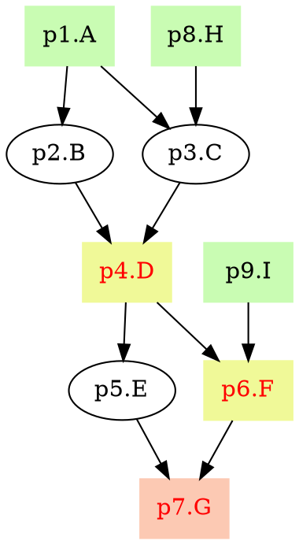

# pyppl - A python lightweight pipeline framework
[Documentation][1] | [API][2] | [Change log][19] | [Fork me][3]

<!-- toc -->
## Features
- Supports of any language to run you processes.
- Automatic deduction of input based on the process dependencies. [Details][4]
- Different ways of exporting output files (including `gzip`). [Details][5]
- Process caching. [Details][6]
- Flexible placeholder handling in output and script settings. [Details][7]
- APIs to modify channels. [Details][8]
- Different runners to run you processes on different platforms. [Details][9]
- Runner customization (you can define your own runner). [Details][10]
- Callbacks of processes. [Details][11]
- Error handling for processes. [Details][12]
- Configuration file support for pipelines. [Details][13]
- Flowchat in [DOT][14] for your pipelines. [Details][15]
- Aggregations (a set of processes predefined). [Details][16]
- Detailed [documentation][1] and [API documentation][2].

## Requirements
- Linux (Maybe works on OSX, not tested)
- Python 2.7

## Installation
```bash
# install latest version
git clone https://github.com/pwwang/pyppl.git
cd pyppl
python setup.py install
# install released version
pip install pyppl
```

## First script
```python
from pyppl import pyppl, proc

pSort         = proc()
# use sys.argv as input channel
pSort.input   = "infile:file"
pSort.output  = "outfile:file:{{infile.fn}}.sorted"
pSort.script  = """
  sort -k1r {{infile}} > {{outfile}}
""" 

pyppl().starts(pSort).run()
```

run `python test.py test1.txt test2.txt test3.txt test4.txt test5.txt` will output:
```
[2017-05-02 20:38:53,837] [  PyPPL] Version: 0.6.1
[2017-05-02 20:38:53,837] [   TIPS] beforeCmd and afterCmd only run locally
[2017-05-02 20:38:53,838] [ CONFIG] Read from /home/m161047/.pyppl
[2017-05-02 20:38:53,838] [   INFO] DOT file saved to: test.pyppl.dot
[2017-05-02 20:38:53,848] [   INFO] Flowchart file saved to: test.pyppl.svg
[2017-05-02 20:38:53,848] [  START] ------------------------------------ pSort -------------------------------------
[2017-05-02 20:38:53,848] [DEPENDS] pSort: START => pSort => END
[2017-05-02 20:38:53,850] [P.PROPS] pSort: cache => True
[2017-05-02 20:38:53,850] [P.PROPS] pSort: echo => False
[2017-05-02 20:38:53,851] [P.PROPS] pSort: forks => 1
[2017-05-02 20:38:53,851] [P.PROPS] pSort: id => pSort
[2017-05-02 20:38:53,851] [P.PROPS] pSort: indir => /home/m161047/tests/workdir/PyPPL.pSort.notag.1Uncltkc/input
[2017-05-02 20:38:53,851] [P.PROPS] pSort: length => 5
[2017-05-02 20:38:53,851] [P.PROPS] pSort: outdir => /home/m161047/tests/workdir/PyPPL.pSort.notag.1Uncltkc/output
[2017-05-02 20:38:53,851] [P.PROPS] pSort: runner => local
[2017-05-02 20:38:53,851] [P.PROPS] pSort: tag => notag
[2017-05-02 20:38:53,851] [P.PROPS] pSort: tmpdir => /home/m161047/tests/workdir
[2017-05-02 20:38:53,851] [P.PROPS] pSort: workdir => /home/m161047/tests/workdir/PyPPL.pSort.notag.1Uncltkc
[2017-05-02 20:38:53,851] [  INPUT] pSort: [0/4]: infile.ext => .txt
[2017-05-02 20:38:53,851] [  INPUT] pSort: [0/4]: # => 0
[2017-05-02 20:38:53,851] [  INPUT] pSort: [0/4]: infile.bn => test1.txt
[2017-05-02 20:38:53,851] [  INPUT] pSort: [0/4]: infile => /home/m161047/tests/workdir/PyPPL.pSort.notag.1Uncltkc/input/test1.txt
[2017-05-02 20:38:53,852] [  INPUT] pSort: [0/4]: infile.fn => test1
[2017-05-02 20:38:53,852] [ OUTPUT] pSort: [4/4]: outfile => /home/m161047/tests/workdir/PyPPL.pSort.notag.1Uncltkc/output/test5.sorted
[2017-05-02 20:38:53,855] [  DEBUG] pSort: Not cached, cache file /home/m161047/tests/workdir/PyPPL.pSort.notag.1Uncltkc/cached.jobs not exists.
[2017-05-02 20:38:53,855] [RUNNING] pSort: /home/m161047/tests/workdir/PyPPL.pSort.notag.1Uncltkc
[2017-05-02 20:38:53,913] [   INFO] pSort: Submitting job #0 ...
[2017-05-02 20:38:54,074] [   INFO] pSort: Submitting job #1 ...
[2017-05-02 20:38:54,328] [   INFO] pSort: Submitting job #2 ...
[2017-05-02 20:38:54,681] [   INFO] pSort: Submitting job #3 ...
[2017-05-02 20:38:55,136] [   INFO] pSort: Submitting job #4 ...
[2017-05-02 20:38:55,149] [  DEBUG] pSort: Successful jobs: ALL
[2017-05-02 20:38:55,149] [   INFO] pSort: Done (time: 00:00:01.301).
[2017-05-02 20:38:55,150] [   DONE] Total time: 00:00:01.301
```

Then you will see your sorted files in `/home/user/tests/workdir/PyPPL.pSort.notag.2BNAjwU1/output/`:  
`test1.sorted  test2.sorted  test3.sorted  test4.sorted  test5.sorted`

## Using a different interpreter:
```python
pPlot = proc()
pPlot.input   = "infile:file"
pPlot.output  = "outfile:file:{{infile.fn}}.png"
pPlot.lang    = "Rscript"
# use the output of pSort as input
pPlot.depends = pSort
pPlot.script  = """
data <- read.table ("{{infile}}")
H    <- hclust(dist(data))
png (figure = “{{outfile}}”)
plot(H)
dev.off()
"""
```

## Using a different runner:
```python
pPlot = proc()
pPlot.input   = "infile:file"
pPlot.output  = "outfile:file:{{infile.fn}}.png"
pPlot.lang    = "Rscript"
pPlot.runner  = "sge"
# run 5 jobs at the same time
pPlot.forks   = 5
pPlot.depends = pSort
pPlot.script  = """
data <- read.table ("{{infile}}")
H    <- hclust(dist(data))
png (figure = “{{outfile}}”)
plot(H)
dev.off()
"""
pyppl({
	"proc": {
		"sgeRunner": {
			"sge_q" : "1-day"
		}
	}
}).starts(pPlot).run()
```

## Draw the pipeline chart
`pyppl` can generate the graph in [DOT language][14]. 
```python
p1 = proc("A")
p2 = proc("B")
p3 = proc("C")
p4 = proc("D")
p5 = proc("E")
p6 = proc("F")
p7 = proc("G")
p8 = proc("H")
p9 = proc("I")
p1.script = "echo 1"
p1.input  = {"input": channel.create(['a'])}
p8.input  = {"input": channel.create(['a'])}
p9.input  = {"input": channel.create(['a'])}
p2.input  = "input"
p3.input  = "input"
p4.input  = "input"
p5.input  = "input"
p6.input  = "input"
p7.input  = "input"
p1.output = "{{input}}" 
p2.script = "echo 1"
p2.output = "{{input}}" 
p3.script = "echo 1"
p3.output = "{{input}}" 
p4.script = "echo 1"
p4.output = "{{input}}" 
p5.script = "echo 1"
p5.output = "{{input}}" 
p6.script = "echo 1"
p6.output = "{{input}}" 
p7.script = "echo 1"
p7.output = "{{input}}" 
p8.script = "echo 1"
p8.output = "{{input}}" 
p9.script = "echo 1"
p9.output = "{{input}}" 
"""
			   1A         8H
			/      \      /
		 2B           3C
			\      /
			  4D(e)       9I
			/      \      /
		 5E          6F(e)
			\      /
			  7G(e)
"""
p2.depends = p1
p3.depends = [p1, p8]
p4.depends = [p2, p3]
p4.exportdir  = "./"
p5.depends = p4
p6.depends = [p4, p9]
p6.exportdir  = "./"
p7.depends = [p5, p6]
p7.exportdir  = "./"
pyppl().starts(p1, p8, p9).flowchart()
# saved to dot file: test.pyppl.dot
# saved to svg file: test.pyppl.svg
```
`test.pyppl.dot`:

You can use different [dot renderers][17] to render and visualize it.

`test.pyppl.svg`:  
![PyPPL chart][18]

[1]: https://pwwang.gitbooks.io/pyppl/
[2]: https://pwwang.gitbooks.io/pyppl/api.html
[3]: https://github.com/pwwang/pyppl/
[4]: https://pwwang.gitbooks.io/pyppl/specify-input-and-output-of-a-process.html#specify-input-of-a-process
[5]: https://pwwang.gitbooks.io/pyppl/export-output-files.html
[6]: https://pwwang.gitbooks.io/pyppl/caching.html
[7]: https://pwwang.gitbooks.io/pyppl/placeholders.html
[8]: https://pwwang.gitbooks.io/pyppl/channels.html
[9]: https://pwwang.gitbooks.io/pyppl/runners.html
[10]: https://pwwang.gitbooks.io/pyppl/runners.html#define-your-own-runner
[11]: https://pwwang.gitbooks.io/pyppl/set-other-properties-of-a-process.html#use-callback-to-modify-the-process-pcallback
[12]: https://pwwang.gitbooks.io/pyppl/set-other-properties-of-a-process.html#error-handling-perrhowperrntry
[13]: https://pwwang.gitbooks.io/pyppl/configure-a-pipeline.html#use-a-configuration-file
[14]: https://en.wikipedia.org/wiki/DOT_(graph_description_language)
[15]: https://pwwang.gitbooks.io/pyppl/draw-flowchart-of-a-pipeline.html
[16]: https://pwwang.gitbooks.io/pyppl/aggregations.html
[17]: https://en.wikipedia.org/wiki/DOT_(graph_description_language)#Layout_programs
[18]: https://github.com/pwwang/pyppl/raw/master/docs/pyppl.png
[19]: https://pwwang.gitbooks.io/pyppl/change-log.html
