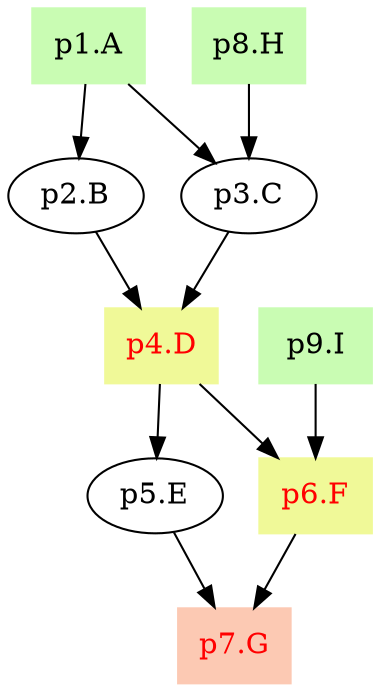

# pyppl - A python lightweight pipeline framework

<!-- START doctoc generated TOC please keep comment here to allow auto update -->
<!-- DON'T EDIT THIS SECTION, INSTEAD RE-RUN doctoc TO UPDATE -->
**Table of Contents**  *generated with [DocToc](https://github.com/thlorenz/doctoc)*

- [Requirements](#requirements)
- [Installation](#installation)
- [First script](#first-script)
- [Using a different interpreter:](#using-a-different-interpreter)
- [Using a different runner:](#using-a-different-runner)
- [Draw the pipeline chart](#draw-the-pipeline-chart)
- [See documentations.](#see-documentations)

<!-- END doctoc generated TOC please keep comment here to allow auto update -->

## Requirements
- Linux (Maybe works on OSX, not tested)
- Python 2.7

## Installation
```python
git clone https://github.com/pwwang/pyppl
cd pyppl
python setup.py install
# or pip install pyppl
```

## First script
```python
from pyppl import pyppl, proc

pSort         = proc()
# use sys.argv as input channel
pSort.input   = "infile:file"
pSort.output  = "outfile:file:{{infile.fn}}.sorted"
pSort.script  = """
  sort -k1r {{infile}} > {{outfile}}
""" 

pyppl().starts(pSort).run()
```

run `python test.py test1.txt test2.txt test3.txt test4.txt test5.txt` will output:
```
[2017-04-21 16:44:35,003] [  PyPPL] Version: 0.5.1
[2017-04-21 16:44:35,003] [   TIPS] beforeCmd and afterCmd only run locally
[2017-04-21 16:44:35,003] [ CONFIG] Read from /home/user/.pyppl
[2017-04-21 16:44:35,003] [  START] --------------------------------- pSort.notag ----------------------------------
[2017-04-21 16:44:35,007] [  DEBUG] pSort.notag: INPUT [4/4]: infile.ext => .txt
[2017-04-21 16:44:35,007] [  DEBUG] pSort.notag: INPUT [4/4]: # => 4
[2017-04-21 16:44:35,007] [  DEBUG] pSort.notag: INPUT [4/4]: infile.bn => test5.txt
[2017-04-21 16:44:35,007] [  DEBUG] pSort.notag: INPUT [4/4]: infile => /home/user/tests/workdir/PyPPL.pSort.notag.2BNAjwU1/input/test5.txt
[2017-04-21 16:44:35,007] [  DEBUG] pSort.notag: INPUT [4/4]: infile.fn => test5
[2017-04-21 16:44:35,007] [  DEBUG] pSort.notag: PROC_VARS: runner => local
[2017-04-21 16:44:35,007] [  DEBUG] pSort.notag: PROC_VARS: echo => False
[2017-04-21 16:44:35,008] [  DEBUG] pSort.notag: PROC_VARS: tag => notag
[2017-04-21 16:44:35,008] [  DEBUG] pSort.notag: PROC_VARS: tmpdir => /home/user/tests/workdir
[2017-04-21 16:44:35,008] [  DEBUG] pSort.notag: PROC_VARS: indir => /home/user/tests/workdir/PyPPL.pSort.notag.2BNAjwU1/input
[2017-04-21 16:44:35,008] [  DEBUG] pSort.notag: PROC_VARS: cache => True
[2017-04-21 16:44:35,008] [  DEBUG] pSort.notag: PROC_VARS: id => pSort
[2017-04-21 16:44:35,008] [  DEBUG] pSort.notag: PROC_VARS: forks => 1
[2017-04-21 16:44:35,008] [  DEBUG] pSort.notag: PROC_VARS: workdir => /home/user/tests/workdir/PyPPL.pSort.notag.2BNAjwU1
[2017-04-21 16:44:35,008] [  DEBUG] pSort.notag: PROC_VARS: outdir => /home/user/tests/workdir/PyPPL.pSort.notag.2BNAjwU1/output
[2017-04-21 16:44:35,008] [  DEBUG] pSort.notag: PROC_VARS: length => 5
[2017-04-21 16:44:35,009] [  DEBUG] pSort.notag: OUTPUT [0/4]: outfile => /home/user/tests/workdir/PyPPL.pSort.notag.2BNAjwU1/output/test1.sorted
[2017-04-21 16:44:35,011] [  DEBUG] pSort.notag: Not cached, cache file /home/user/tests/workdir/PyPPL.pSort.notag.2BNAjwU1/cached.jobs not exists.
[2017-04-21 16:44:35,011] [RUNNING] pSort.notag: /home/user/tests/workdir/PyPPL.pSort.notag.2BNAjwU1
[2017-04-21 16:44:36,069] [  DEBUG] pSort.notag: Successful jobs: ALL
[2017-04-21 16:44:36,069] [   INFO] pSort.notag: Done (time: 00:00:01,066).
[2017-04-21 16:44:36,070] [   DONE] Total time: 00:00:01,066
```

Then you will see your sorted files in `/home/user/tests/workdir/PyPPL.pSort.notag.2BNAjwU1/output/`:  
`test1.sorted  test2.sorted  test3.sorted  test4.sorted  test5.sorted`

## Using a different interpreter:
```python
pPlot = proc()
pPlot.input   = "infile:file"
pPlot.output  = "outfile:file:{{infile.fn}}.png"
pPlot.lang    = "Rscript"
# use the output of pSort as input
pPlot.depends = pSort
pPlot.script  = """
data <- read.table ("{{infile}}")
H    <- hclust(dist(data))
png (figure = “{{outfile}}”)
plot(H)
dev.off()
"""
```

## Using a different runner:
```python
pPlot = proc()
pPlot.input   = "infile:file"
pPlot.output  = "outfile:file:{{infile.fn}}.png"
pPlot.lang    = "Rscript"
pPlot.runner  = "sge"
# run 5 jobs at the same time
pPlot.forks   = 5
pPlot.depends = pSort
pPlot.script  = """
data <- read.table ("{{infile}}")
H    <- hclust(dist(data))
png (figure = “{{outfile}}”)
plot(H)
dev.off()
"""
pyppl({
	"proc": {
		"sgeRunner": {
			"sge_q" : "1-day"
		}
	}
}).starts(pPlot).run()
```

## Draw the pipeline chart
`pyppl` can generate the graph in [dot language](https://en.wikipedia.org/wiki/DOT_(graph_description_language)). 
```python
ppl = pyppl()
p1 = proc("A")
p2 = proc("B")
p3 = proc("C")
p4 = proc("D")
p5 = proc("E")
p6 = proc("F")
p7 = proc("G")
p8 = proc("H")
p9 = proc("I")
p1.script = "echo 1"
p1.input  = {"input": channel.create(['a'])}
p8.input  = {"input": channel.create(['a'])}
p9.input  = {"input": channel.create(['a'])}
p2.input  = "input"
p3.input  = "input"
p4.input  = "input"
p5.input  = "input"
p6.input  = "input"
p7.input  = "input"
p1.output = "{{input}}" 
p2.script = "echo 1"
p2.output = "{{input}}" 
p3.script = "echo 1"
p3.output = "{{input}}" 
p4.script = "echo 1"
p4.output = "{{input}}" 
p5.script = "echo 1"
p5.output = "{{input}}" 
p6.script = "echo 1"
p6.output = "{{input}}" 
p7.script = "echo 1"
p7.output = "{{input}}" 
p8.script = "echo 1"
p8.output = "{{input}}" 
p9.script = "echo 1"
p9.output = "{{input}}" 
"""
			   1A         8H
			/      \      /
		 2B           3C
			\      /
			  4D(e)       9I
			/      \      /
		 5E          6F(e)
			\      /
			  7G(e)
"""
p2.depends = p1
p3.depends = [p1, p8]
p4.depends = [p2, p3]
p4.exportdir  = "./"
p5.depends = p4
p6.depends = [p4, p9]
p6.exportdir  = "./"
p7.depends = [p5, p6]
p7.exportdir  = "./"
ppl.starts(p1, p8, p9)
print ppl.dot() # save it in pyppl.dot
```
`pyppl.dot`:

You can use different dot [renderers](https://en.wikipedia.org/wiki/DOT_(graph_description_language)#Layout_programs) to render and visualize it.


## See [documentations](http://pyppl.readthedocs.io/en/latest/).

