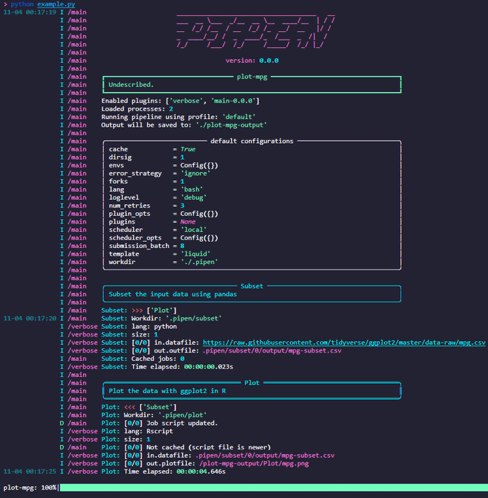

# pipen - A pipeline framework for python
<!--
[![Pypi][1]][2] [![Github][3]][4] [![PythonVers][5]][2] [![docs][6]][7] [![building][8]][7] [![Codacy][9]][10] [![Codacy coverage][11]][10]

[Documentation][7] | [API][11] | [Change log][12]
-->


## Installation
```bash
pip install -U pipen
```

## Quickstart
`example.py`
```python
from pipen import Proc, Pipen

class Subset(Proc):
    """Subset the input data using pandas"""
    input = 'datafile'
    input_data = ['https://raw.githubusercontent.com/tidyverse/ggplot2/master/data-raw/mpg.csv']
    output = 'outfile:file:mpg-subset.csv'
    lang = 'python'
    script = """
        import pandas
        data = pandas.read_csv('{{in.datafile}}')
        data = data[['model', 'displ']]
        data.to_csv('{{out.outfile}}')
    """

class Plot(Proc):
    """Plot the data with ggplot2 in R"""
    requires = Subset
    input = 'datafile:file'
    output = 'plotfile:file:mpg.png'
    lang = 'Rscript'
    script = """
        library(ggplot2)
        data = read.csv('{{in.datafile}}')
        png('{{out.plotfile}}')
        ggplot(data) + geom_boxplot(aes(x=model, y=displ)) +
            theme(axis.text.x = element_text(angle = 90, vjust = 0.5, hjust=1))
        dev.off()
    """

if __name__ == '__main__':
    pipen = Pipen(name='plot-mpg', starts=Subset)
    pipen.run()
```

```shell
$ python example.py
```


