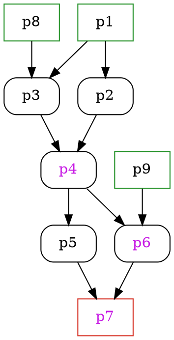

# [PyPPL][3] - A [Py](#)thon [P](#)i[P](#)e[L](#)ine framework 

![Pypi][22] ![Github][23] ![Codacy][4] ![Codacy coverage][11] ![Travis building][8]

[Documentation][1] | [API][2] | [Change log][19] | [FAQ][26]

<!-- toc -->
## Features
- [Easy-to-use command line parser.][27]
- [Fancy logs.][28]
- [Process caching.][6]
- [Script templating (using either builtin engine or Jinja2).][7]
- [Runner customization][9].
- [Error handling for processes.][10]
- [Easy-switching running profile.][9]
- Flowchat in [DOT][14] for your pipelines ([Details][15]).
- [Aggregations (a set of processes predefined).][16]
- Highly reusable processes (see [a set of highly reusable bioinformatics processes][24]).

## Requirements
- OS: Linux, OSX, WSL (Windows Subsystem for Linux) or Cygwin
- Python 2.7 or Python 3.6
- Python packages: [six][25], [filelock][35], [loky][17], [futures][21] (suggested: [graphviz][36], [pyyaml][33] and [python-testly][5]).

## Installation
```bash
# install latest version
git clone https://github.com/pwwang/PyPPL.git
cd PyPPL
python setup.py install
# or simply:
pip install git+git://github.com/pwwang/PyPPL.git

# install released version
pip install PyPPL

# run tests 
pip install python-testly
# or pip install git+git://github.com/pwwang/testly.git
make test

# run tests only for python2
make test2

# run tests only for python3
make test3

# run tutorials
make tutorials
```

## Get started
See `tutorials/getStarted/`  
Sort 5 files simultaneously: 
```python
1. from pyppl import PyPPL, Proc, Channel

2. pSort         = Proc(desc = 'Sort files.')
3. pSort.input   = {"infile:file": Channel.fromPattern("./data/*.txt")}
4. pSort.output  = "outfile:file:{{in.infile | fn}}.sorted"
5. pSort.forks   = 5
6. pSort.exdir   = './export'
7. pSort.script  = """
  sort -k1r {{in.infile}} > {{out.outfile}} 
""" 

8. PyPPL().start(pSort).run()
```

**Line 1**: Import the modules.  
**Line 2**: Define the process with a description.  
**Line 3**: Define the input data for the process.  
**Line 4**: Define the output. Templates are also applied here.  
**Line 5**: Define how many jobs are running simultaneously.  
**Line 6**: Set the directory to export the output files.  
**Line 7**: Set your script to run.  
**Line 8**: Set the starting process and run the pipeline.  

![getStarted][20]
```
> ls -l ./export
total 0
-rw-rw-rw- 1 pwwang pwwang 44 Sep 14 20:50 test1.sorted
-rw-rw-rw- 1 pwwang pwwang 56 Sep 14 20:50 test2.sorted
-rw-rw-rw- 1 pwwang pwwang 59 Sep 14 20:50 test3.sorted
-rw-rw-rw- 1 pwwang pwwang 58 Sep 14 20:50 test4.sorted
-rw-rw-rw- 1 pwwang pwwang 58 Sep 14 20:50 test5.sorted
```

## Infer input channel from dependent process
See `tutorials/inputFromDependent/`  
If a process depends on another one, the input channel can be deduced from the output channel of the latter process.  
Sort 5 files and then add line number to each line.
```python
from pyppl import PyPPL, Proc, Channel

pSort        = Proc(desc = 'Sort files.')
pSort.input  = {"infile:file": Channel.fromPattern("./data/*.txt")}
pSort.output = "outfile:file:{{in.infile | fn}}.sorted"
pSort.forks  = 5
pSort.script = """
  sort -k1r {{in.infile}} > {{out.outfile}} 
""" 

pAddPrefix         = Proc(desc = 'Add line number to each line.')
pAddPrefix.depends = pSort
# automatically inferred from pSort.output
pAddPrefix.input   = "infile:file"  
pAddPrefix.output  = "outfile:file:{{in.infile | fn}}.ln"
pAddPrefix.exdir   = './export'
pAddPrefix.forks   = 5
pAddPrefix.script  = """
paste -d. <(seq 1 $(wc -l {{in.infile}} | cut -f1 -d' ')) {{in.infile}} > {{out.outfile}}
""" 

PyPPL().start(pSort).run()
```
```
> head -3 ./export/test1.ln
1.8984
2.663
3.625
```

## Modify input channel
See `tutorials/transformInputChannels/`  
Sort 5 files, add line numbers, and merge them into one file.
```python
from pyppl import PyPPL, Proc, Channel

pSort        = Proc(desc = 'Sort files.')
pSort.input  = {"infile:file": Channel.fromPattern("./data/*.txt")}
pSort.output = "outfile:file:{{in.infile | fn}}.sorted"
pSort.forks  = 5
pSort.script = """
  sort -k1r {{in.infile}} > {{out.outfile}} 
""" 

pAddPrefix         = Proc(desc = 'Add line number to each line.')
pAddPrefix.depends = pSort
pAddPrefix.input   = "infile:file"  # automatically inferred from pSort.output
pAddPrefix.output  = "outfile:file:{{in.infile | fn}}.ln"
pAddPrefix.forks   = 5
pAddPrefix.script  = """
paste -d. <(seq 1 $(wc -l {{in.infile}} | cut -f1 -d' ')) {{in.infile}} > {{out.outfile}}
""" 

pMergeFiles         = Proc(desc = 'Merge files, each as a column.')
pMergeFiles.depends = pAddPrefix
# Transform it into a list of files
# ["test1.ln", "test2.ln", ..., "test5.ln"]
pMergeFiles.input   = {"infiles:files": lambda ch: [ch.flatten()]}
pMergeFiles.output  = "outfile:file:mergedfile.txt"
pMergeFiles.exdir   = "./export"
pMergeFiles.script  = """
paste {{in.infiles | asquote}} > {{out.outfile}}
"""

PyPPL().start(pSort).run()
```
```
> head -3 ./export/mergedfile.txt
1.8984  1.6448  1.2915  1.7269  1.7692
2.663   2.3369  2.26223 2.3866  2.7536
3.625   3.28984 3.25945 3.29971 3.30204
```

## Use a different language
See `tutorials/differentLang/`  
Plot heatmap using R.
```python
from pyppl import PyPPL, Proc

pHeatmap        = Proc(desc = 'Draw heatmap.')
pHeatmap.input  = {'seed': 8525}
pHeatmap.output = "outfile:file:heatmap.png"
pHeatmap.exdir  = './export'
# Use full path "/path/to/Rscript" if it's not in $PATH
# You can also use a shebang in script
# in this case: #!/usr/bin/env Rscript
pHeatmap.lang   = 'Rscript' 
pHeatmap.script = """
set.seed({{in.seed}})
mat = matrix(rnorm(100), ncol=10)
png(filename = "{{out.outfile}}")
heatmap(mat)
dev.off()
"""

PyPPL().start(pHeatmap).run()
```
`./export/heatmap.png`  
![heatmap.png][29]

## Use args
See `tutorials/useArgs/`  
If the jobs are sharing the same set of configurations (in this case, the number of rows and columns of the matrix), they can be set in `pXXX.args`. The other benefit is to make the channels intact if the configurations are not suppose to be channeling.  
```python
from pyppl import PyPPL, Proc

pHeatmap           = Proc(desc = 'Draw heatmap.')
pHeatmap.input     = {'seed': [1,2,3]}
pHeatmap.output    = "outfile:file:heatmap{{in.seed}}.png"
pHeatmap.exdir     = "./export"
pHeatmap.forks     = 3
pHeatmap.args.ncol = 10
pHeatmap.args.nrow = 10
pHeatmap.lang      = 'Rscript' # or /path/to/Rscript if it's not in $PATH
pHeatmap.script = """
set.seed({{in.seed}})
mat = matrix(rnorm({{args.ncol, args.nrow | lambda x, y: x*y}}), ncol={{args.ncol}})
png(filename = "{{out.outfile}}", width=150, height=150)
heatmap(mat)
dev.off()
"""

PyPPL().start(pHeatmap).run()
```

|`./export/heatmap1.png`|`./export/heatmap2.png`|`./export/heatmap3.png`|
|-----------------------|-----------------------|-----------------------|
|  ![heatmap1.png][30]  |  ![heatmap2.png][31]  |  ![heatmap3.png][32]  |

## Use the command line argument parser
See `tutorials/useParams/`  
```python
from pyppl import PyPPL, Proc, Channel, params

params.datadir    \
  .setRequired()  \
  .setDesc('The data directory containing the data files.')

# or
# params.datadir.required = True
# params.datadir.desc     = 'The data directory containing the data files.'

params = params.parse()

pSort         = Proc(desc = 'Sort files.')
pSort.input   = {"infile:file": Channel.fromPattern(params.datadir + '/*.txt')}
pSort.output  = "outfile:file:{{in.infile | fn}}.sorted"
pSort.forks   = 5
pSort.exdir   = './export'
pSort.script  = """
  sort -k1r {{in.infile}} > {{out.outfile}} 
""" 

PyPPL().start(pSort).run()

```
Run the pipeline:  
`> python useParams.py`
```
USAGE:
  useParams.py -datadir <str>

REQUIRED OPTIONS:
  -datadir <str>                        The data directory containing the data files.

OPTIONAL OPTIONS:
  -h, --help, -H, -?                    Print this help information.
```
Provide value to `-datadir`:  
`> python useParams.py -datadir ./data`

## Use a different runner
See `/tutorials/differentRunner/`
```python
from pyppl import PyPPL, Proc, Channel

pSort         = Proc(desc = 'Sort files.')
pSort.input   = {"infile:file": Channel.fromPattern("./data/*.txt")}
pSort.output  = "outfile:file:{{in.infile | fn}}.sorted"
# specify the runner
pSort.runner  = 'sge'
# specify the runner options
pSort.sgeRunner = {
	"sge.q" : "1-day"
}
pSort.forks   = 5
pSort.exdir   = './export'
pSort.script  = """
  sort -k1r {{in.infile}} > {{out.outfile}} 
""" 

PyPPL().start(pSort).run()
# or run all process with sge runner:
# PyPPL().start(pSort).run('sge')
# or:
# PyPPL({
#   'default': {
#       'runner': 'sge', 
#       'sgeRunner': {'sge.q': '1-day'}
#   }
# }).start(pSort).run()
```

## Use Jinja2 as template engine
See `/tutorials/useJinja2/`
```python
from pyppl import PyPPL, Proc, Channel

pSort          = Proc(desc = 'Sort files.')
pSort.input    = {"infile:file": Channel.fromPattern("./data/*.txt")}
# Notice the different between builtin template engine and Jinja2
pSort.output   = "outfile:file:{{ fn(in.infile) }}.sorted"
# pSort.output = "outfile:file:{{in.infile | fn}}.sorted"
pSort.forks    = 5
# You have to have Jinja2 installed (pip install Jinja2)
pSort.template = 'Jinja2'
pSort.exdir    = './export'
pSort.script   = """
  sort -k1r {{in.infile}} > {{out.outfile}} 
""" 

PyPPL().start(pSort).run()
```

## Debug your script
See `/tutorials/debugScript/`  
You can directly go to `<workdir>/<job.index>/job.script` to debug your script, or you can also print some values out throught `PyPPL` log system.  
```python
from pyppl import PyPPL, Proc

pHeatmap           = Proc(desc = 'Draw heatmap.')
pHeatmap.input     = {'seed': [1,2,3,4,5]}
pHeatmap.output    = "outfile:file:heatmap{{in.seed}}.png"
pHeatmap.exdir     = "./export"
# Don't cache jobs for debugging
pHeatmap.cache     = False
# Output debug information for all jobs, but don't echo stdout and stderr
pHeatmap.echo      = {'jobs': range(5), 'type': ''}
pHeatmap.args.ncol = 10
pHeatmap.args.nrow = 10
pHeatmap.lang      = 'Rscript' # or /path/to/Rscript if it's not in $PATH
pHeatmap.script = """
set.seed({{in.seed}})
mat = matrix(rnorm({{args.ncol, args.nrow | lambda x, y: x*y}}), ncol={{args.ncol}})
png(filename = "{{out.outfile}}", width=150, height=150)

# have to be on stderr
cat("pyppl.log.debug:Plotting heatmap #{{job.index | lambda x: int(x) + 1}} ...", file = stderr())

heatmap(mat)
dev.off()
"""

PyPPL({
	'_log': {
		'levels' : 'basic',
		'lvldiff': []
	}
}).start(pHeatmap).run()
```
You will get something like this in your log:
![debugScript.png][34]

## Switch runner profiles
See `tutorials/siwthcRunnerProfile/`  
We can define a set of runner profiles in a `json` file (`./profiles.json`):

```json
{
  "default": {
    "runner": "local",
    "forks" : 1,
    "sgeRunner": {
      "sge.q": "1-day"
    } 
  },
  "local5": {
    "runner": "local",
    "forks":  5
  },
  "sge7days": {
    "runner": "sge",
    "sgeRunner": {
      "sge.q": "7-days"
    }
  }
}
```

or you can also use `.yaml`(`pyyaml` is required) file:
```yaml
default:
  runner: local
  forks : 1
  sgeRunner:
    sge.q: 1-day
local5:
  runner: local
  forks : 5
sge7days:
  runner: local
  sgeRunner:
    sge.q: 7-days
```

To switch profile:
```python
# default profile (default)
PyPPL(cfgfile = "./profiles.json").start(pHeatmap).run()
# switch to local5 or sge7days:
# PyPPL(cfgfile = "./profiles.json").start(pHeatmap).run('local5')
# PyPPL(cfgfile = "./profiles.json").start(pHeatmap).run('sge7days')

# You may also use runner name as profile, which means to run using the runner with default options:
# PyPPL(cfgfile = "./profiles.json").start(pHeatmap).run('sge') # use 1-day queue
```

## Draw the pipeline chart
`PyPPL` can generate the graph in [DOT language][14]. 
```python
from pyppl import PyPPL, Proc

p1 = Proc()
p2 = Proc()
p3 = Proc()
p4 = Proc()
p5 = Proc()
p6 = Proc()
p7 = Proc()
p8 = Proc()
p9 = Proc()
"""
		   p1         p8
		/      \      /
	 p2           p3
		\      /
		   p4         p9
		/      \      /
	 p5          p6 (export)
		\      /
		  p7 (export)
"""
p2.depends = p1
p3.depends = p1, p8
p4.depends = p2, p3
p4.exdir   = "./export"
p5.depends = p4
p6.depends = p4, p9
p6.exdir   = "./export"
p7.depends = p5, p6
p7.exdir   = "./export"

# make sure at least one job is created.
p1.input = {"in": [0]}
p8.input = {"in": [0]}
p9.input = {"in": [0]}

PyPPL().start(p1, p8, p9).flowchart().run()
```
`drawFlowchart.pyppl.dot`:


To generate svg file, you have to have [graphviz][36] installed.  
`drawFlowchart.pyppl.svg`:  
![PyPPL chart][18]


***Enjoy pipelining!!!***

[1]: https://pwwang.github.io/PyPPL/
[2]: https://pwwang.github.io/PyPPL/api/
[3]: https://github.com/pwwang/pyppl/
[4]: https://img.shields.io/codacy/grade/a04aac445f384a8dbe47da19c779763f.svg?style=flat-square
[5]: https://github.com/pwwang/testly
[6]: https://pwwang.github.io/PyPPL/caching/
[7]: https://pwwang.github.io/PyPPL/placeholders/
[8]: https://img.shields.io/travis/pwwang/PyPPL.svg?style=flat-square
[9]: https://pwwang.github.io/PyPPL/runners/
[10]: https://pwwang.github.io/PyPPL/error-handling/
[11]: https://img.shields.io/codacy/coverage/a04aac445f384a8dbe47da19c779763f.svg?style=flat-square
[12]: https://pwwang.github.io/PyPPL/set-other-properties-of-a-process/#error-handling-perrhowperrntry
[13]: https://pwwang.github.io/PyPPL/configure-a-pipeline/#use-a-configuration-file
[14]: https://en.wikipedia.org/wiki/DOT_(graph_description_language)
[15]: https://pwwang.github.io/PyPPL/draw-flowchart-of-a-pipeline/
[16]: https://pwwang.github.io/PyPPL/aggregations/
[17]: https://github.com/tomMoral/loky
[18]: https://raw.githubusercontent.com/pwwang/PyPPL/master/docs/drawFlowchart_pyppl.png
[19]: https://pwwang.github.io/PyPPL/change-log/
[20]: https://raw.githubusercontent.com/pwwang/PyPPL/master/docs/getStarted.png
[21]: https://pypi.org/project/futures/
[22]: https://img.shields.io/pypi/v/pyppl.svg?style=flat-square
[23]: https://img.shields.io/github/tag/pwwang/PyPPL.svg?style=flat-square
[24]: https://github.com/pwwang/bioprocs
[25]: https://github.com/benjaminp/six
[26]: https://pwwang.github.io/PyPPL/faq/
[27]: https://pwwang.github.io/PyPPL/command-line-argument-parser/
[28]: https://pwwang.github.io/PyPPL/configure-your-logs/
[29]: https://raw.githubusercontent.com/pwwang/PyPPL/master/docs/heatmap.png
[30]: https://raw.githubusercontent.com/pwwang/PyPPL/master/docs/heatmap1.png
[31]: https://raw.githubusercontent.com/pwwang/PyPPL/master/docs/heatmap2.png
[32]: https://raw.githubusercontent.com/pwwang/PyPPL/master/docs/heatmap3.png
[33]: https://github.com/yaml/pyyaml
[34]: https://raw.githubusercontent.com/pwwang/PyPPL/master/docs/debugScript.png
[35]: https://github.com/benediktschmitt/py-filelock
[36]: https://github.com/xflr6/graphviz
