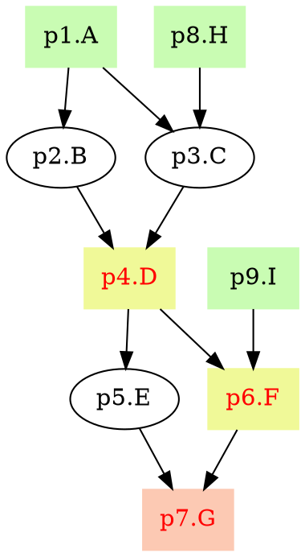

# pyppl - A python lightweight pipeline framework
![Pypi][22] ![Github][23] ![Gitbook][21]   

[Documentation][1] | [API][2] | [Change log][19] | [FAQ][26] | [Fork me][3]

<!-- toc -->
## Features
- Supports of any language to run you processes.
- [Easy-to-use command line parser.][27]
- [Automatic deduction of input based on the process dependencies.][4]
- [Different ways of exporting output files (including `gzip`).][5]
- [Process caching (including caching using exported files).][6]
- [Expectations of process output.][25]
- [Flexible placeholder handling in output and script settings.][7]
- [APIs to modify channels.][8]
- [Different runners to run you processes on different platforms.][9]
- [Runner customization (you can define your own runner).][10]
- [Callfronts/Callbacks of processes.][11]
- [Error handling for processes.][12]
- [Configuration file support for pipelines.][13]
- Flowchat in [DOT][14] for your pipelines ([Details][15]).
- Highly reusable processes (see [a set of highly reusable bioinformatics processes][24]).
- [Aggregations (a set of processes predefined).][16]
- Detailed [documentation][1] and [API documentation][2].

## Requirements
- Linux, OSX or WSL (Windows Subsystem for Linux)
- Python 2.7+ (python3 supported)

## Installation
```bash
# install latest version
git clone https://github.com/pwwang/pyppl.git
cd pyppl
python setup.py install
# or simly:
pip install git+git://github.com/pwwang/pyppl.git

# install released version
pip install pyppl
```

## First script
To sort 5 files simultaneously: 
```python
1. from pyppl import pyppl, proc, channel

2. pSort         = proc(desc = 'Sort files.')
3. pSort.input   = "infile:file"
4. pSort.output  = "outfile:file:{{infile | fn}}.sorted"
5. pSort.forks   = 5
6. pSort.exdir   = './'
7. pSort.script  = """
sort -k1r {{infile}} > {{outfile}}
""" 

8. pyppl().starts(pSort).run()
"""
```

**Line 1**: Import the modules.  
**Line 2**: Define the process with a description.  
**Line 3**: Define the input data for the process.  
* No data was specified, it will use `sys.argv`.   
* Full format should be: `{"infile:file": channel.fromArgv()}`.  

**Line 4**: Define the output. Placeholders and functions call be used.  
**Line 5**: Define how many jobs are running simultaneously.  
**Line 6**: Set the directory to export the output files.  
**Line 7**: Set Your script to run.  
**Line 8**: Set the starting processes and run the pipeline.  

![First-script-output][20]

## Multiple processes 
Sort each 5 file and then combine them into one file
```python
from pyppl import pyppl, proc, channel, params

params.infiles = []
params.infiles.desc = "Input files."
params.parse()

pSort         = proc(desc = "Sort files.")
pSort.input   = {"infile:file": params.infiles.value}
pSort.output  = "outfile:file:{{infile | fn}}.sorted"
pSort.script  = """
  sort -k1r {{infile}} > {{outfile}}
""" 

pCombine          = proc(desc = "Combine files.")
pCombine.depends  = pSort   # will automatically use pSort's output as input data
pCombine.input    = {"infiles:files": lambda ch: [ch.toList()]}
pCombine.output   = "outfile:file:{{infiles | [0] | fn}}_etc.sorted"
pCombine.exdir    = "./export" 
pCombine.script   = """
> {{outfile}}
for infile in {{infiles | asquote}}; do
	cat $infile >> {{outfile}}
done
"""

# Only need to specify start processes
pyppl().starts(pSort).run()
```

Run the pipeline: 
```bash
python pipeline.py --param-infiles test?.txt
```

## Using a different language
```python
pPlot = proc()
# Specify input explicitly
pPlot.input   = {"infile:file": ["./data.txt"]}
# data.png
pPlot.output  = "outfile:file:{{infile | fn}}.png"
pPlot.lang    = "Rscript"
pPlot.script  = """
data <- read.table ("{{infile}}")
H    <- hclust(dist(data))
png (figure = “{{outfile}}”)
plot(H)
dev.off()
"""
```

## Using a different runner
```python
pPlot = proc()
pPlot.input   = {"infile:file": ["./data1.txt", "./data2.txt", "./data3.txt", "./data4.txt", "./data5.txt"]}
pPlot.output  = "outfile:file:{{infile.fn}}.png"
pPlot.lang    = "Rscript"
pPlot.runner  = "sge"
# run all 5 jobs at the same time
pPlot.forks   = 5
pPlot.script  = """
data <- read.table ("{{infile}}")
H    <- hclust(dist(data))
png (figure = “{{outfile}}”)
plot(H)
dev.off()
"""
pyppl({
  "proc": {
    "sgeRunner": {
      "sge.q" : "1-day"
    }
  }
}).starts(pPlot).run()
```

## Draw the pipeline chart
`pyppl` can generate the graph in [DOT language][14]. 
```python
# "A" is the tag of p1
p1 = proc("A")
p2 = proc("B")
p3 = proc("C")
p4 = proc("D")
p5 = proc("E")
p6 = proc("F")
p7 = proc("G")
p8 = proc("H")
p9 = proc("I")
"""
		   1A         8H
		/      \      /
	 2B           3C
		\      /
		  4D(e)       9I
		/      \      /
	 5E          6F(e)
		\      /
		  7G(e)
"""
p2.depends = p1
p3.depends = [p1, p8]
p4.depends = [p2, p3]
p4.exdir   = "./"
p5.depends = p4
p6.depends = [p4, p9]
p6.exdir   = "./"
p7.depends = [p5, p6]
p7.exdir   = "./"
pyppl().starts(p1, p8, p9).flowchart()
# saved to dot file: test.pyppl.dot
# saved to svg file: test.pyppl.svg
# run it after the chart generated:
# pyppl().starts(p1, p8, p9).flowchart().run()
```
`test.pyppl.dot`:

You can use different [dot renderers][17] to render and visualize it.

`test.pyppl.svg`:  
![PyPPL chart][18]

[1]: https://pwwang.gitbooks.io/pyppl/
[2]: https://pwwang.gitbooks.io/pyppl/api.html
[3]: https://github.com/pwwang/pyppl/
[4]: https://pwwang.gitbooks.io/pyppl/specify-input-and-output-of-a-process.html#specify-input-of-a-process
[5]: https://pwwang.gitbooks.io/pyppl/export-output-files.html
[6]: https://pwwang.gitbooks.io/pyppl/caching.html
[7]: https://pwwang.gitbooks.io/pyppl/placeholders.html
[8]: https://pwwang.gitbooks.io/pyppl/channels.html
[9]: https://pwwang.gitbooks.io/pyppl/runners.html
[10]: https://pwwang.gitbooks.io/pyppl/runners.html#define-your-own-runner
[11]: https://pwwang.gitbooks.io/pyppl/set-other-properties-of-a-process.html#use-callback-to-modify-the-process-pcallback
[12]: https://pwwang.gitbooks.io/pyppl/set-other-properties-of-a-process.html#error-handling-perrhowperrntry
[13]: https://pwwang.gitbooks.io/pyppl/configure-a-pipeline.html#use-a-configuration-file
[14]: https://en.wikipedia.org/wiki/DOT_(graph_description_language)
[15]: https://pwwang.gitbooks.io/pyppl/draw-flowchart-of-a-pipeline.html
[16]: https://pwwang.gitbooks.io/pyppl/aggregations.html
[17]: https://en.wikipedia.org/wiki/DOT_(graph_description_language)#Layout_programs
[18]: https://github.com/pwwang/pyppl/raw/master/docs/pyppl.png
[19]: https://pwwang.gitbooks.io/pyppl/change-log.html
[20]: https://github.com/pwwang/pyppl/raw/master/docs/firstScript.png
[21]: https://www.gitbook.com/button/status/book/pwwang/pyppl
[22]: https://badge.fury.io/py/pyppl.svg
[23]: https://badge.fury.io/gh/pwwang%2Fpyppl.svg
[24]: https://github.com/pwwang/bioprocs
[25]: https://pwwang.gitbooks.io/pyppl/content/set-other-properties-of-a-process.html#set-expectations-of-a-process
[26]: https://pwwang.gitbooks.io/pyppl/content/faq.html
[27]: https://pwwang.gitbooks.io/pyppl/command-line-argument-parser.html
