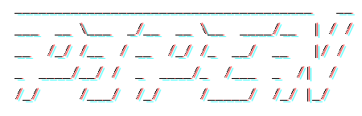

<div align="center">
    

<font size=4>**A pipeline framework for python**</font>

[Documentation][1] | [ChangeLog][2] | [Examples][3] | [API][4]


</div>

______________________________________________________________________

## Features

- Easy to use
- Nearly zero-configuration
- Highly extendable

## Installation
```bash
pip install -U pipen
```

## Quickstart

`example.py`
```python
from pipen import Proc, Pipen

class P1(Proc):
    """Sort input file"""
    input = "infile"
    input_data = ["/tmp/data.txt"]
    output = "outfile:file:intermediate.txt"
    script = "cat {{in.infile}} | sort > {{out.outfile}}"

class P2(Proc):
    """Paste line number"""
    requires = P1
    input = "infile"
    output = "outfile:file:result.txt"
    script = "paste <(seq 1 3) {{in.infile}} > {{out.outfile}}"

Pipen().run(P1)
```

```shell
> echo -e "3\n2\n1" > /tmp/data.txt
> python example.py
```

```log
[09/13/21 04:23:37] I main                        _____________________________________   __
[09/13/21 04:23:37] I main                        ___  __ \___  _/__  __ \__  ____/__  | / /
[09/13/21 04:23:37] I main                        __  /_/ /__  / __  /_/ /_  __/  __   |/ /
[09/13/21 04:23:37] I main                        _  ____/__/ /  _  ____/_  /___  _  /|  /
[09/13/21 04:23:37] I main                        /_/     /___/  /_/     /_____/  /_/ |_/
[09/13/21 04:23:37] I main
[09/13/21 04:23:37] I main                                     version: 0.1.0
[09/13/21 04:23:37] I main
[09/13/21 04:23:37] I main    ╭══════════════════════════════════ PIPEN-0 ═══════════════════════════════════╮
[09/13/21 04:23:37] I main    ║  # procs          = 2                                                        ║
[09/13/21 04:23:37] I main    ║  plugins          = ['main', 'verbose-0.0.1']                                ║
[09/13/21 04:23:37] I main    ║  profile          = default                                                  ║
[09/13/21 04:23:37] I main    ║  outdir           = pipen-0_results                                          ║
[09/13/21 04:23:37] I main    ║  cache            = True                                                     ║
[09/13/21 04:23:37] I main    ║  dirsig           = 1                                                        ║
[09/13/21 04:23:37] I main    ║  error_strategy   = ignore                                                   ║
[09/13/21 04:23:37] I main    ║  forks            = 1                                                        ║
[09/13/21 04:23:37] I main    ║  lang             = bash                                                     ║
[09/13/21 04:23:37] I main    ║  loglevel         = info                                                     ║
[09/13/21 04:23:37] I main    ║  num_retries      = 3                                                        ║
[09/13/21 04:23:37] I main    ║  plugin_opts      = {}                                                       ║
[09/13/21 04:23:37] I main    ║  plugins          = None                                                     ║
[09/13/21 04:23:37] I main    ║  scheduler        = local                                                    ║
[09/13/21 04:23:37] I main    ║  scheduler_opts   = {}                                                       ║
[09/13/21 04:23:37] I main    ║  submission_batch = 8                                                        ║
[09/13/21 04:23:37] I main    ║  template         = liquid                                                   ║
[09/13/21 04:23:37] I main    ║  template_opts    = {}                                                       ║
[09/13/21 04:23:37] I main    ║  workdir          = ./.pipen                                                 ║
[09/13/21 04:23:37] I main    ╰══════════════════════════════════════════════════════════════════════════════╯
[09/13/21 04:23:37] I main
[09/13/21 04:23:37] I main    ╭───────────────────────────────────── P1 ─────────────────────────────────────╮
[09/13/21 04:23:37] I main    │ Sort input file                                                              │
[09/13/21 04:23:37] I main    ╰──────────────────────────────────────────────────────────────────────────────╯
[09/13/21 04:23:37] I main    P1: Workdir: '.pipen/pipen-0/p1'
[09/13/21 04:23:37] I main    P1: <<< [START]
[09/13/21 04:23:37] I main    P1: >>> ['P2']
[09/13/21 04:23:37] I verbose P1: size: 1
[09/13/21 04:23:37] I verbose P1: [0/0] in.infile: /tmp/data.txt
[09/13/21 04:23:37] I verbose P1: [0/0] out.outfile:
                      /home/pwwang/github/pipen/.pipen/pipen-0/p1/0/output/intermediate.txt
[09/13/21 04:23:38] I verbose P1: Time elapsed: 00:00:01.039s
[09/13/21 04:23:38] I main
[09/13/21 04:23:38] I main    ╭═════════════════════════════════════ P2 ═════════════════════════════════════╮
[09/13/21 04:23:38] I main    ║ Paste line number                                                            ║
[09/13/21 04:23:38] I main    ╰══════════════════════════════════════════════════════════════════════════════╯
[09/13/21 04:23:38] I main    P2: Workdir: '.pipen/pipen-0/p2'
[09/13/21 04:23:38] I main    P2: <<< ['P1']
[09/13/21 04:23:38] I main    P2: >>> [END]
[09/13/21 04:23:38] I verbose P2: size: 1
[09/13/21 04:23:38] I verbose P2: [0/0] in.infile:
                      /home/pwwang/github/pipen/.pipen/pipen-0/p1/0/output/intermediate.txt
[09/13/21 04:23:38] I verbose P2: [0/0] out.outfile: /home/pwwang/github/pipen/pipen-0_results/P2/result.txt
[09/13/21 04:23:40] I verbose P2: Time elapsed: 00:00:02.074s
[09/13/21 04:23:40] I main

                PIPEN-0: 100%|█████████████████████████████████████████████████| 2/2 [00:04<00:00, 0.56 procs/s]
```

```shell
> cat ./pipen-0_results/P2/result.txt
1       1
2       2
3       3
```

[1]: https://pwwang.github.io/pipen
[2]: https://pwwang.github.io/pipen/changelog
[3]: https://pwwang.github.io/pipen/examples
[4]: https://pwwang.github.io/pipen/API
