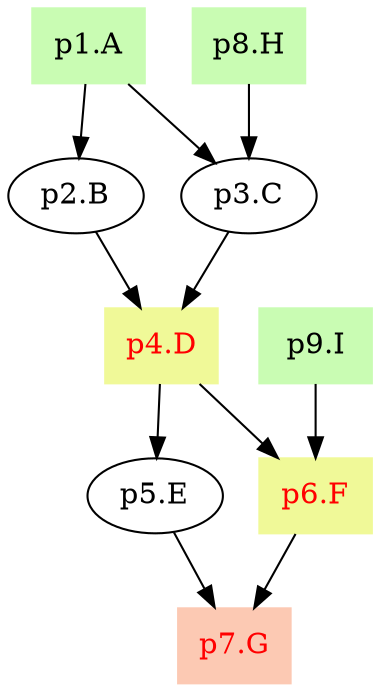

# pyppl - A python lightweight pipeline framework

<!-- START doctoc generated TOC please keep comment here to allow auto update -->
<!-- DON'T EDIT THIS SECTION, INSTEAD RE-RUN doctoc TO UPDATE -->
**Table of Contents**  *generated with [DocToc](https://github.com/thlorenz/doctoc)*

- [Requirements](#requirements)
- [Installation](#installation)
- [First script](#first-script)
- [Using arguments](#using-arguments)
- [Using a different interpreter:](#using-a-different-interpreter)
- [Draw the pipeline chart](#draw-the-pipeline-chart)
- [See documentations.](#see-documentations)

<!-- END doctoc generated TOC please keep comment here to allow auto update -->

## Requirements
- Python 2.7

## Installation
```python
pip install pyppl
# or python setup.py install
```

## First script
```python
import sys
from pyppl import pyppl, proc, channel

inchan = channel.create (list("Hello"))

p_upper           = proc('upper')
p_upper.input     = {"in": inchan}
p_upper.output    = "outfile:file:{{in}}.txt"
p_upper.exportdir = "./"
p_upper.script    = """
  echo {{in}} | tr '[:lower:]' '[:upper:]' > {{outfile}}
""" 

pyppl().starts(p_upper).run()
```

It will output:
```
[2017-02-02 16:23:32,515] [  PyPPL] Version: 0.1.0
[2017-02-02 16:23:32,515] [   TIPS] You can find the stderr in <workdir>/scripts/script.<index>.stderr
[2017-02-02 16:23:32,517] [RUNNING] p_upper.upper: /tmp/PyPPL_p_upper_upper.6bf016ac
[2017-02-02 16:23:33,056] [ EXPORT] p_upper.upper: ./H.txt (copy)
[2017-02-02 16:23:33,058] [ EXPORT] p_upper.upper: ./e.txt (copy)
[2017-02-02 16:23:33,058] [ EXPORT] p_upper.upper: ./l.txt (copy)
[2017-02-02 16:23:33,059] [ EXPORT] p_upper.upper: ./l.txt (copy)
[2017-02-02 16:23:33,060] [ EXPORT] p_upper.upper: ./o.txt (copy)
[2017-02-02 16:23:33,061] [   DONE]
```

The first process tries to uppercase all letters, the second then write them to files and export them.

## Using arguments
Say we save the script as first.py:

```python
p_upper           = proc('upper')
p_upper.input     = "in" # no channels assigned
p_upper.output    = "outfile:file:{{in}}.txt"
p_upper.exportdir = "./"
p_upper.script    = """
  echo {{in}} | tr '[:lower:]' '[:upper:]' > {{outfile}}
""" 

pyppl().starts(p_upper).run()
```
then run the script:
```shell
python first.py w
```
will only have `w` capitalized and saved.

To have more letters involved, you have to specify the `input` as:
```python
p_upper.input  = {"in": channel.fromArgv(1)}
```
Then run:
```bash
python first.py H e l l o
```
will have the same output as the first script.

## Using a different interpreter:
```python
p_python = proc()
p_python.input = "in"
p_python.output = "out:{{in}}"
p_python.defaultSh = "python"
p_python.script = "print {{in}}"
""" or you can also specify a shebang in script:
p_python.script = "
#!/usr/bin/env python
print "{{in}}"
"
"""
pyppl().starts(p_python).run()
```

## Draw the pipeline chart
`pyppl` can generate the graph in [dot language](https://en.wikipedia.org/wiki/DOT_(graph_description_language)). `def dot(self)` 
```python
ppl = pyppl ()
p1 = proc("A")
p2 = proc("B")
p3 = proc("C")
p4 = proc("D")
p5 = proc("E")
p6 = proc("F")
p7 = proc("G")
p8 = proc("H")
p9 = proc("I")
p1.script = "echo 1"
p1.input  = {"input": channel(['a'])}
p1.output = "{{input}}" 
p2.script = "echo 1"
p2.output = "{{input}}" 
p3.script = "echo 1"
p3.output = "{{input}}" 
p4.script = "echo 1"
p4.output = "{{input}}" 
p5.script = "echo 1"
p5.output = "{{input}}" 
p6.script = "echo 1"
p6.output = "{{input}}" 
p7.script = "echo 1"
p7.output = "{{input}}" 
p8.script = "echo 1"
p8.output = "{{input}}" 
p9.script = "echo 1"
p9.output = "{{input}}" 

"""
          1A         8H
      /      \      /
      2B         3C
        \      /
        4D(e)       9I
      /      \      /
      5E          6F(e)
        \      /
        7G(e)
"""
p2.depends = p1
p3.depends = [p1, p8]
p4.depends = [p2, p3]
p4.exportdir  = "./"
p5.depends = p4
p6.depends = [p4, p9]
p6.exportdir  = "./"
p7.depends = [p5, p6]
p7.exportdir  = "./"
ppl.starts(p1, p8, p9)
print ppl.dot() # save it in pyppl.dot
```
`pyppl.dot`:

You can use different dot [renderers](https://en.wikipedia.org/wiki/DOT_(graph_description_language)#Layout_programs) to render and visualize it.


## See [documentations](docs/DOCS.md).

