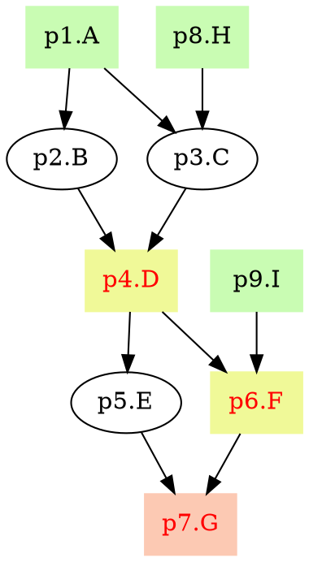

# Documentataion for pyppl


<!-- START doctoc generated TOC please keep comment here to allow auto update -->
<!-- DON'T EDIT THIS SECTION, INSTEAD RE-RUN doctoc TO UPDATE -->
**Table of Contents**  *generated with [DocToc](https://github.com/thlorenz/doctoc)*

- [Documentataion for pyppl](#documentataion-for-pyppl)
  - [`proc`](#proc)
    - [Initialize `proc`](#initialize-proc)
    - [Properties of `proc`](#properties-of-proc)
      - [Property `tag`](#property-tag)
      - [Property `tmpdir`](#property-tmpdir)
      - [Property `workdir`](#property-workdir)
      - [Property `retcodes`](#property-retcodes)
      - [Property `errorhow`](#property-errorhow)
      - [Property `errorntry`](#property-errorntry)
      - [Property `cache`](#property-cache)
      - [Property `echo`](#property-echo)
      - [Property `forks`](#property-forks)
      - [Property `defaultSh`](#property-defaultsh)
      - [Property `exportdir`](#property-exportdir)
      - [Property `exporthow`](#property-exporthow)
      - [Property `exportow`](#property-exportow)
      - [Property `beforeCmd`](#property-beforecmd)
      - [Property `afterCmd`](#property-aftercmd)
      - [Property `input`](#property-input)
      - [Property `output`](#property-output)
      - [Property `script`](#property-script)
      - [Property `args`](#property-args)
      - [Property `depends`](#property-depends)
      - [Property `callback`](#property-callback)
      - [Property `callfront`](#property-callfront)
      - [Property `runner`](#property-runner)
  - [Runners](#runners)
    - [Base class `runner_local`](#base-class-runner_local)
      - [Initialize `runner_local`](#initialize-runner_local)
      - [Static method `chmod_x`](#static-method-chmod_x)
      - [Get configuration values `_config`](#get-configuration-values-_config)
      - [Get return code `rc`](#get-return-code-rc)
      - [Tell whether the job completes expectedly `isValid`](#tell-whether-the-job-completes-expectedly-isvalid)
      - [Run the job `run`](#run-the-job-run)
    - [ssh runner](#ssh-runner)
    - [sge runner](#sge-runner)
    - [custom runner](#custom-runner)
  - [`channel`](#channel)
    - [Initialize a `channel`](#initialize-a-channel)
      - [`create`](#create)
      - [`fromChannels`](#fromchannels)
      - [`fromPath`](#frompath)
      - [`fromPairs`](#frompairs)
      - [`fromArgv`](#fromargv)
    - [Methods of `channel`](#methods-of-channel)
      - [`width`](#width)
      - [`length`](#length)
      - [`map`](#map)
      - [`filter`](#filter)
      - [`reduce`](#reduce)
      - [`merge`](#merge)
      - [`split`](#split)
      - [`insert`](#insert)
      - [`expand`](#expand)
      - [`collapse`](#collapse)
      - [`copy`](#copy)
    - [Assign data of a channel to variables of `input/output` of a `proc`](#assign-data-of-a-channel-to-variables-of-inputoutput-of-a-proc)
  - [`strtpl`](#strtpl)
    - [Use template without interplolation](#use-template-without-interplolation)
    - [Use string interplolation](#use-string-interplolation)
      - [Use methods of `str`](#use-methods-of-str)
      - [Use independent functions](#use-independent-functions)
      - [Use lambda functions](#use-lambda-functions)
      - [Get sub-strings](#get-sub-strings)
      - [Use modules](#use-modules)
      - [Use a chain of interplolations](#use-a-chain-of-interplolations)
  - [`pyppl`](#pyppl)
    - [Initialize `pyppl`](#initialize-pyppl)
    - [Select start processes](#select-start-processes)
    - [Run the pipeline](#run-the-pipeline)
    - [Draw the pipeline chart](#draw-the-pipeline-chart)

<!-- END doctoc generated TOC please keep comment here to allow auto update -->


## `proc`
`proc` is the basic unit in `pyppl`, it defines process running within a pipeline.
### Initialize `proc`
```python
someproc = proc (tag = 'notag')
```
When initialize a `proc`, you can specify a `tag`. Processes are identified by `id` and `tag`. `Id` is the variable name of the instance (`someproc` here for example)

> - Basically, `pyppl` doesn't allow to declare two processes with the same `id` and `tag`, but you can use different `tag`s with the same `id`
> - You can clone a `proc` by `copy` method: `p1 = proc(); p2=p1.copy("newtag")`

### Properties of `proc`
You can set the property of a `proc` instance simply by:
```
someproc.tag = 'newtag'
```

#### Property `tag`
A tag to mark the process.

#### Property `tmpdir`
The directory where the cache file and default work directory (`PyPPL_<id>_<tag>.<suffix>` will be stored.

#### Property `workdir`
The work directory of the process. You can, but not recommended to, set `workdir`. Instead, you can just set `tmpdir`, the work directory will be automatically generated.

The structure of work directory:
- work directory
  - `input`: input files/directories
  - `output`: output files/directories
  - `scripts`
    - `script.<index>` (scripts for the process)
    - `script.<index>.stdout`
    - `script.<index>.stderr`
    - `script.<index>.rc` (return value) 

> You can check and run `script.<index>` to debug the script for the process

#### Property `retcodes`
In most case, we expect our script return `0` when it completes successfully. But this allow you to have other return codes as valid. Invalid return codes will cause:
- Retry to run the script (if `errorhow` is set to `retry`)
- Process not to be cached
- Still not valid after retry, process terminated.

> You can set `retcodes` by either `p.retcodes = [0, 1]` or `p.retcodes = "0,1"`

#### Property `errorhow`
Defines what to do if a script failed (return codes invalid). 
- `retry`: try to run the script again (see `errorntry`)
- `ignore`: ignore the process and continue running the next process
- `terminate`: terminate the whole pipeline

#### Property `errorntry`
How many times we should retry the script if it fails.

#### Property `cache`
Whether we should cache the process or not. `pyppl` will not cache a process when:
- Property `cache` set to `False`
- Cache file not exists
- Input file not exists
- Input file is newer than output file
- Expected output file not exists
- Dependent processes not cached
- Process failed

#### Property `echo`
Whether to show the stdout and stderr of the process (including `script`, `beforeCmd` and `afterCmd`).

#### Property `forks`
How many processes are allow to run simultaneously.

#### Property `defaultSh`
The default interpreter, defaults to `bash`

#### Property `exportdir`
The directory that the output files export to. 

#### Property `exporthow`
How the output files will be exported:
- `copy`: will copy the output files to `exportdir`.
- `move`: will move the output files to `exportdir`, symbol links will be kept in work directory to make sure dependent processes can run normally (if dependent processes depend on the files).
- `symlink`: will create symbol links of output files in `exportdir`.

#### Property `exportow`
If target file/directory exists, whether we should overwrite it or not.

#### Property `beforeCmd`
The command executed before the main jobs. 

#### Property `afterCmd`
The command executed after the main jobs. 
> Note: both `beforeCmd` and `afterCmd` just run locally, no matter whatever runner you choosed. See [runner](#property-runner).

#### Property `input`
The input of the process.  
It basically accepts key:value dicts. The value should `channel`s (see [channel](#channel) and the key could be: `<name>:<type>`, or a series of it: `<name1>:<type1>, <name2>:<type2>, ...` There are only two available types: `var` and `file (or path)`. Then the data in value will be mapped to each key names.
>- In each key:value pair, width of the value (`channel`, see [channel-width](#width)) must be equal or greater than the number of key variables.
>- If `type` is `var`, it can be omiited. So `<name>` equals to `<name>:var`
>- If `type` is `file/path`, a symbol link with the same basename will be created in the work directory.
>- `input` accepts `str`, `list` and `dict`. If `input` is `str`, it should be `<name>:<type>`s separated by comma (,); if it is `list`, it should be a `list` of `<name>:<type>`s; if it is `dict`, it should be key:value pairs as mentioned above. For `str` and `list`, the data will be read from the output channel(s) (see [Property channel](property-channel)) of its dependent process(es). If it is a start process (with no dependent processes), the data is from `sys.argv` (see [channel-fromArgv](#fromArgv)).
>- If the process depends on multiple processes, then the merged channel (see [channel-merge](#merge) of channels for dependent processes will be used.
>- Examples: 
>```
>p.input = "input"
>p.input = "input1, input2, infile:file"
>p.input = ["input1", "input2", "infile:file"]
>p.input = {"input1": channel1, "input2, infile:file": channel2}
>```

#### Property `output`
The output of the process.  
`output`is similar as `input`, it is also basically key:value dicts. For keys, except for `<name>` and `<type>`, you have to specify what should be output. So a typical key should be `<name>:<value>:<content>`. The `<content>` could be a string include template to specify what should be save to the output/specified channel.
>- `<name>` could be omitted if you don't need to use this in the `script` or anywhere else. 
>- `<type>` could be omitted if `type` is `var`.
>- `<name>` could not be set as `var` unless you set `<type>` explictly. Because `var:whatever` will be expanded to `whatever:var:whatever`
>- `<content>` is allowed to used templates (see [strtpl](#strtpl)). Data can be used include `input`, some scalar `proc` properties and values set in property `args` (see [Property args](#property-args)).
>   - If there is a `file/path` variable in `input`, say `infile` (key for `input` should be `infile:file`), you can also use `{{infile.bn}}`, `{{infile.fn}}` and `{{infile.ext}}` to get basename, filename and ext of `infile` respectively. Of cause you can get the whole path of `infile` by using `{{infile}}`.
>   - If `infile` is `/a/b/c.txt` then `{{infile.bn}}`, `{{infile.fn}}` and `{{infile.ext}}` should be `c.txt`, `c` and `.txt` respectively.
>   - Note that if you use the whole path of `infile` then you are not supposed to use `type` `file/path`, because the default output directory is the work directory of the process.
>   - Availble placeholder for `proc` properties: `{{proc.id}}`, `{{proc.tag}}`, `{{proc.tmpdir}}`, `{{proc.forks}}`, `{{proc.cache}}`, `{{proc.workdir}}`, `{{proc.echo}}`, `{{proc.runner}}`, `{{proc.errorhow}}`, `{{proc.errorntry}}`, `{{proc.defaultSh}}`, `{{proc.exportdir}}`, `{{proc.exporhow}}`, `{{proc.exportow}}`, `{{proc.indir}}`, `{{proc.outdir}}`
>- `output` could also be `str` or `list`, that is, a string of a comma (,) concatenated keys or a list of keys. If then, the output data will be stored in property `channel` (see [Property channel](property-channel)).
>- Even you specify the channels you want to save the data to, another copy of data will be still saved in `proc.channel`. In order to keep the sequence when you specify in `output`, we have to use `OrderedDict`. So instead of using `dict` (i.e. `{"key2": channel1, "key1": channel2}`), which does not guarantee the sequence of data stored in `proc.channel` is the save as `key2` and then `key1`, we use items of `OrderedDict` (i.e. `[("key2", channel1), ("key1": channel1)]`).
>- Examples:
>```
>p.output = "{{input}}2" 
># input: ['a', 'b', 'c'] => p.channel: a channel of [('a2',), ('b2',), ('c2',)]
>
>p.output = ["{{input}}2", "outfile:file:{{infile.fn}}2{{infile.ext}}"]
># input: [('a', '/a/b/a.txt'), ('b', '/a/b/b.txt'), ('c', '/a/b/c.txt')]
># => p.channel: a channel of [('a2', '<workdir>/output/a2.txt'), ('b2', '<workdir>/output/b2.txt'), ('c2', '<workdir>/output/c2.txt')]
># you can use `{{outfile}}` in `script` for the whole path of output file.
>
>p.output = {"out:var:{{input}}2": outchannel}
># input: ['a', 'b', 'c'] 
># => outchannel: a channel of [('a2',), ('b2',), ('c2',)]
># => p.channel:  a channel of [('a2',), ('b2',), ('c2',)]
>
>p.output = {"{{input}}2": ch2, "{{input}}1": ch1}
># input: ['a', 'b', 'c']
># => ch2: a channel of [('a2',), ('b2',), ('c2',)]
>#    ch1: [('a1',), ('b1',), ('c1',)]
># However, it does not guarantee p.channel is a channel of [('a2', 'a1'), ('b2', 'b1'), ('c2', 'c1')] 
># To make sure the data in p.channel is in the order you give to output, used item of OrderedDict:
>p.output = [("{{input}}2", ch2), ("{{input}}1", ch1)]
>```

#### Property `script`
The script that this process will be used to run.  
- It accepts template file, meaning you can save the script into a file and specify it: `template:some-tplfile`
- It uses `strtpl` for variables of `input`, `output` and `proc` properties (see [strtpl](#strtpl)), as well as `{{#}}` to indicate the index of the job in the process.
- You can also use `args` placeholder for specific arguments for the script (see [Property args](#property-args)).
- Instead of specify `defaultSh`, you can use shebang to specify the interpreter (i.e. `#!/usr/bin/env python`).

#### Property `args`
`args` is design for the flexibility of the script. Say you have a sophisiticated process and save it in another file so that you can reuse it, but you want to change some parameters (for example, the number of threads: `nthread`) when calling it. Let's say your script of the process is like:
```python
p.script = """
multithreading-programe arguments -n <nthread>
"""
```
Without `args`, you can just write a fixed `<nthread>`, so that will be:
```python
multithreading-programe arguments -n 12
```
In you new pipeline, if you want to change `-n` then you have to rewrite total `script`. With `args`, you don't have to this, you can just use a placeholder for `<nthread>`:
```python
p.args = {"nthread": 12}  # default value
p.script = """
multithreading-programe arguments -n {{proc.args.nthread}}
"""
```
When you try to reuse it:
```python
p.args = {"nthread": 8}  # change the value
```
Then the process will run:
```bash
multithreading-programe arguments -n 8
```

#### Property `depends`
This specifies the dependent processes.
- You can set one process: `p.depends = theother-p` or multiple processes: `p.depends = [theother-p, another-p, ...]`
- If a process has multiple dependent processes and input channel is not specified (`str` or `list` is set for `input`, see [Property input](#property-input)), the channel used for input is the merged channel (see [channel-merge](#merge) of channels of all dependent processes.
- Note that a process must depend on some other process(es) to run if it is not the start process.

#### Property `callback`
`callback` is called after a process is finished. Typically it is used to change the data that is used by it's dependent processes, for instance, `channel`.
One example could be:
```python
p1 = proc ('callback')
p2 = proc ('callback')

def callback (s): # take the proc instance as argument
  ch = channel.create ([('a1','b'), ('x', 'y')])
  s.channel.merge (ch)

sys.argv    = [0, 1, 2]
p1.input    = {"input": channel.fromArgv(1)}
p1.output   = "output:{{input}}2"
p1.script   = "echo {{output}}"
p1.callback = callback

p2.depends  = p1
p2.input    = "input, in1, in2" # I need more input variables, added in callback
p2.script   = "echo {{output}}"
p2.output   = "output:{{input}}.{{in1}}.{{in2}}"
pyppl ().starts(p1).run()
```

#### Property `callfront`
`callfront` is similar as `callback`, but is called before process runs.

#### Property `runner`
Set the `runner` for the process. The default `runner` is `local`. `pyppl` has 3 built-in runners: `local`, `sge` and `ssh` (see [Runners](#Runners)).

## Runners
### Base class `runner_local`
#### Initialize `runner_local`
```python
# script: the script file to run
# config: the props of `proc`
def __init__(self, script, config = {})
```

#### Static method `chmod_x`
A static method tries to make the script file executable. If failed, tries to get the interpreter from shebang of the script file.
```python
@staticmethod
def chmod_x(file)
```

#### Get configuration values `_config`
```python
# key: the key in the config
# default: the default value if the key doesn't exist
def _config(self, key, default=None)
```
> You can use dot (`.`) to get the value of a sub-item. For example: the config is `{'a': {'b': 1}}`, then `r._config('a.b') == 1`

#### Get return code `rc`
```python
# Try to read the return code from the rc file: <workdir>/scripts/script.<index>.rc
# If it does not exist or is empty, return -99
def rc (self)
```

#### Tell whether the job completes expectedly `isValid`
```python
# compare the return code with _config('retcodes'), if the return code is allowed, then the job is valid, otherwise invalid.
def isValid(self)
```

#### Run the job `run`
```python
# Try to run the job, and write stdout to <workdir>/scripts/script.<index>.stdout, stderr to <workdir>/scripts/script.<index>.stderr and return code to <workdir>/scripts/script.<index>.rc.
# If it fails, try to rerun the job according to _config('errorhow') and _config('errorntry')
def run (self)
```

### ssh runner
`runner_ssh` extends `runner_local`. It tries to send jobs via ssh channel. You have to set servers in the config: `{'sshRunner': {'servers': [<available servers>]}}`. For those servers, you have to setup so that you can login without password prompt (maybe by following [steps](https://linuxconfig.org/passwordless-ssh)).  
The ssh script can be found at: `<workdir>/scripts/script.<index>.ssh`.

### sge runner
You can also use sge runner. To configure the runner, you can do `p.sgeRunner = {<options>}`. Typically, the options is according to the arguments needed by `qsub`. For example, `qsub` takes `-q` to specify the queue, then you can set the options: `p.sgeRunner = {'sge_q': '1-day', ...}`.
>- Options for `qsub` must start with `sge_`.
>- In case an option has multiple values, for example, you can set multiple values for `-l`: `-l h_vmem=20G` and `-l h_stack=128M`, you can add some spaces right after `sge_l` in the options: `p.sgeRunner = {'sge_q': '1-day', 'sge_l': 'h_vmem=20G', 'sge_l ': 'h_stack=128M', ...}`. Note that the second `sge_l` has one space followed so that `h_vmem=20G` would not be override by the latter value.  
>- For bool options, you can use `True` as value. For example, for `-notify`, you can set `{'sge_notify': True}`
>- You can set some scripts (`bash`) before and after the main job runs on the cluster (`p.sgerunner: {'preScript': ..., 'postScript': ..., 'sge_q', '1-hour', ...}`. NOTE:
>    - `preScript` and `postScript` are different from `beforeCmd` and `afterCmd`. The former ones run on clusters, while latter ones just run locally.
>    - You cannot use placeholders with `strtpl` for `preScript` and `postScript`.


### custom runner
Yes, you can write your own runners, just write a class (i.e. `runner_custom`) extending `runner_local`, import it, and register it before use (`proc.registerRunner(runner_custom)`). 

## `channel`
`channel` is actually a `list` of `tuple`s that can be used for `input/output` of a `proc`. Class `channel` extends `list`, so you can perform `list` operations on `channel`.

### Initialize a `channel`
There are different ways to initialize a `channel`:

#### `create`
Create from a `list`: `channel.create(l)`
```python
c = channel.create([1, 2, 3])
# c == [(1,), (2,), (3,)]

c = channel.create(["abc", "def", "ghi"])
# c == [("abc",), ("def",), ("ghi",)]
```

#### `fromChannels`
Create from multiple channels: `channel.fromChannels(*channels)`
```python
c1 = channel.create([1, 2, 3])
c2 = channel.create(["abc", "def", "ghi"])
c = channel.fromChannels (c1, c2)
# c == [(1, "abc"), (2, "def"), (3, "ghi")]
```

#### `fromPath`
Use a pattern to collect files/paths: `channel.fromPath(pattern, type = "any")`  
`type` could be `file` for files, `dir` for directories, `link` for links and `any` for all matched items.
```python
c = channel.fromPath (os.path.join('/some/dir/', '*'))
# c == [('/some/dir/1.txt',), ('/some/dir/2.txt',), ('/some/dir/3.txt',), ('/some/dir/subdir/', )]

c = channel.fromPath (os.path.join('/some/dir/', '*'), 'file')
# c == [('/some/dir/1.txt',), ('/some/dir/2.txt',), ('/some/dir/3.txt',)]

c = channel.fromPath (os.path.join('/some/dir/', '*'), 'dir')
# c == [('/some/dir/subdir/', )]
```

#### `fromPairs`
Use a pattern to collect paired files/paths: `channel.fromPairs(pattern)`
```python
"""
> ls
> 'a_1.txt' 'a_2.txt' 'b_1.txt' 'b_2.txt' 'c_1.txt' 'c_2.txt' 
"""
c = channel.fromPairs ('*_*.txt')
# c == [('a_1.txt', 'a_2.txt'), ('b_1.txt', 'b_2.txt'), ('c_1.txt', 'c_2.txt')]
```

#### `fromArgv`
Create from `sys.argv`: `channel.fromArgv(width = 1)`  
A channel will be create actually based on `sys.argv[1:]`
```python
sys.argv = ["0", "11", "22", "33", "44"]
c = channel.fromArgv(None) # take all elements in one tuple
# c == [("11", "22", "33", "44")]
c = channel.fromArgv(2) # take every 2 elements in one tuple
# c == [("11", "22"), ("33", "44")]
c = channel.fromArgv(3)
# raises Exception, len(sys.argv[1:]) must be exactly divided by width
```

### Methods of `channel`
#### `width`
The width of a channel: `c.width()`
```python
"""
[ 
  |<-- width -->|
  (1, 2, ..., 3),   ---
  (4, 5, ..., 6),    |
  ...,            length
  ...,               |
  (x, y, ..., z)    ---
]
"""
```

#### `length`
The length of a channel: `c.length()`

#### `map`
Call a function on each element and return a new channel: `c_new = c.map(func)`
```python
c1 = channel.create([("abc", "def"), ("ghi", "opq")])
c2 = channel.create(["abc", "opq"])
c1 = c1.map (lambda x: (x[0] + '.c1', x[1]))
c2 = c2.map (lambda x: len(x[0])) # even you don't use tuple to create, but channel convert each element to tuple, in this case: ("abc", ) and ("opq",) so you have to used x[0] here.
# c1 == [("abc.c1", "def"), ("ghi.c1", "opq")]
# c2 == [(3, ), (3, )]
```

#### `filter`
Perform a filter on the channel: `c.filter(func)`
```python
c = channel.create([1,2,3,4,5]).filter(lambda x: x[0]<3)
# c == [(1, ), (2, )]
```

#### `reduce`
Perform reduct on the channel: `c.reduce(func)`
```python
c = channel.create([("abc", "def"), ("ghi", "opq")]).reduce(lambda x,y: (x[0]+y[0], x[1]+y[1]))
# c == [('abcghi', ), ('defopq',)]
```

#### `merge`
Merge myself with other channels: `c.merge(*channels)`
```python
c1 = channel.create ([("abc", "def"), ("ghi", "opq")])
c2 = channel.create (["abc", "def", "ghi", "opq"])
# c1.merge(c2)
# raises Exception, the length is different (2 vs 4)

c3 = channel.create(["1", '2', '3', '4'])	
c5 = [5,6,7,8]
c6 = channel.create()
c6.merge (c2, c3 ,c5)
# c6 chaned!
# c6 == [("abc", "1", 5), ("def", '2', 6), ("ghi", '3', 7), ("opq", '4', 8)]
```

#### `split`
Split a channel into multiple channels with width equals to 1
```python
(ca, cb, cc) = c7.split()
# ca == c2
# cb == c3
# cc == c5
# ca.split() == [ca]
```

#### `insert`
Insert a column: `c.insert(idx, val)`
- Use `idx=None` to append
- None-tuple value will be extended to equal-length channel and then merged.
```python
c1 = channel.create([1,2,3,4,5])
c1.insert(0, 1)
# c1 == [(1,1), (1,2), (1,3), (1,4), (1,5)]
```

#### `expand`
Expand the channel: `c.expand(col = 0, pattern = "*")` according to the files `col`th column, other cols will keep the same
```
# [(dir1/dir2, 1)].expand (0, "*") will expand to
# [(dir1/dir2/file1, 1), (dir1/dir2/file2, 1), ...]
# length: 1 -> N
# width:  M -> M
```

#### `collapse`
Do the reverse of expand: `c.collapse (col = 0)`
```
# length: N -> 1
# width:  M -> M
```
> NOTE: it will not check whether the items at `col`th column are in the same directory. It will only take the first element and take the dirname.

#### `copy`
Make a copy of the channel: `c.copy()`
> NOTE: it uses `copy.copy` instead of `copy.deepcopy`


### Assign data of a channel to variables of `input/output` of a `proc`
```python
p.input = {"a,b,...,c": ch}
"""
[ 
  "a, b, ..., c"
   |  |       |
  (1, 2, ..., 3), 
  (4, 5, ..., 6), 
  ...,            
  ...,            
  (x, y, ..., z)  
]

a => [1, 4, ..., x]
b => [2, 5, ..., y]
...
c => [3, 6, ..., z]
"""
```

## `strtpl`
A string template not only uses placeholders to format a string but also takes function for string interplolation.

To use it: `strtpl.format(tpl, data)`

The placeholders in `tpl` must start with `{{` and end with `}}`

### Use template without interplolation
```python
tpl = "Hello, {{name}}, {{greetings}}!"
strtpl.format (tpl, {"name": "Sam", "greetings": "nice to meet you"})
# => "Hello, Sam, nice to meet you!"
strtpl.format (tpl, {"name": "Tom", "greetings": "how are you"})
# => "Hello, Tom, how are you!"
```

### Use string interplolation
`|` is used to separate variable name and interplolation functions, to escape it use: `\|`

#### Use methods of `str`
These methods are member functions of `str`, for example, `.upper()`, `.lower()`, `find()`, etc.
```python
strtpl.format("{{v | .upper()}}", {'v': 'hello'})
# => HELLO
strtpl.format("{{v | .find('|')}}", {'v': 'hel|lo'})
# => "3" 
# Note: | is inside '' so it's not used as a delimiter
#       strtpl.format always returns str. But inside the chain, it could return other types. 
#       For example: {{v | sum(_)}} while v = [1,2,3,4] returns "10"
```

#### Use independent functions
You have to use underscore (`_`) as placeholder for the data in the argument list of these functions.
```python
strtpl.format("{{v | len(_)}}", {'v': "hello"})
# => "5"
```

#### Use lambda functions
You have to call the function instead of just declare the function. That means using `(lambda x: ...)(_)` rather than just `lambda x: ...`
```python
strtpl.format("{{v | (lambda x: x[0].upper() + x[1:])(_)}}", {"v": "hello"})
# => Hello
```

#### Get sub-strings
We can just specify the range like we normally do for a `str`:
```python
strtpl.format ("{{v | [2:]}}", {'v': 'hello'})
# => llo
```

#### Use modules
You have to import modules in the blocks by `__import__`
```python
strtpl.format ("{{v | __import__('math').pow(float(_), 2.0)}}", {'v': 3})
# => "9.0"
# Note: you have to convert the data to float to fit the function
```

#### Use a chain of interplolations
You can chain the interplolations by concatenating them using `|`:
```python
strtpl.format ("{{v | .upper() | (lambda x: x+'123')(_) | [2:] | len(_) | __import__('math').pow(float(_), 2.0)}}", {'v': 'hello'})
# => "36.0"
```

## `pyppl`
`pyppl` is used to assemble the processes and run them.

### Initialize `pyppl`
You can set configs when initialize `pyppl`: `def __init__(self, config={}, cfile=None)`

- You can set a config file in JSON format, then all `pyppl` instances can share the same configuration. If it is not given, it will try to use `os.path.join(os.path.expanduser('~'), '.pyppl')`, for example, on linux: `$HOME/.pyppl`
- You can set `loglevel` in `config`, the default is `info`, available level could be `critical`, `error`, `warning`, `info`, `debug`, `notset`.
- You can set values of properties for processes in `proc`: 
```json
{ 
  "proc": {
    "args": {"nthread": 8},
    "tmpdir": "/path/to/tmp"
  }
}
```
> Note if a property is explictly set, it is not override by config of `pyppl`. For example, before the previous configuration, we have `p.tmpdir = '/some/other/tmp'`, then `p.tmpdir == '/some/other/tmp'`.
- You can also set different profiles for the processes:
```json
{
  "loglevel": "debug",
  "proc": { // defaults
    "args": {"nthread": 16}
  }, 
  "local": { // profile
    "tmpdir": "/tmp",
    "args": {"nthread": 8}
  },
  "sge": { // profile
    "sgeRunner": {...},
    "tmpdir": "/sge/tmp",
    "args": {"nthread": 1}
  } 
}
```

### Select start processes
Set the start process(es). `def starts(self. *args)`  
You can select multiple processes to start with: `ppl.starts(p1, p2)`
> For a pipeline, you could even select some middle processes to start with, but you have to specify the input for them.

### Run the pipeline
You can specify the profile to run. `def run(self, profile = 'local')`  
For previous configs, you can just switch the runner from `pyppl.run('local')` to `pyppl.run('sge')`.

### Draw the pipeline chart
`pyppl` can generate the graph in [dot language](https://en.wikipedia.org/wiki/DOT_(graph_description_language)). `def dot(self)` 
```python
ppl = pyppl ()
p1 = proc("A")
p2 = proc("B")
p3 = proc("C")
p4 = proc("D")
p5 = proc("E")
p6 = proc("F")
p7 = proc("G")
p8 = proc("H")
p9 = proc("I")
p1.script = "echo 1"
p1.input  = {"input": channel(['a'])}
p1.output = "{{input}}" 
p2.script = "echo 1"
p2.output = "{{input}}" 
p3.script = "echo 1"
p3.output = "{{input}}" 
p4.script = "echo 1"
p4.output = "{{input}}" 
p5.script = "echo 1"
p5.output = "{{input}}" 
p6.script = "echo 1"
p6.output = "{{input}}" 
p7.script = "echo 1"
p7.output = "{{input}}" 
p8.script = "echo 1"
p8.output = "{{input}}" 
p9.script = "echo 1"
p9.output = "{{input}}" 

"""
          1A         8H
      /      \      /
      2B         3C
        \      /
        4D(e)       9I
      /      \      /
      5E          6F(e)
        \      /
        7G(e)
"""
p2.depends = p1
p3.depends = [p1, p8]
p4.depends = [p2, p3]
p4.exportdir  = "./"
p5.depends = p4
p6.depends = [p4, p9]
p6.exportdir  = "./"
p7.depends = [p5, p6]
p7.exportdir  = "./"
ppl.starts(p1, p8, p9)
print ppl.dot() # save it in pyppl.dot
```
`pyppl.dot`:

You can use different dot [renderers](https://en.wikipedia.org/wiki/DOT_(graph_description_language)#Layout_programs) to render and visualize it.


