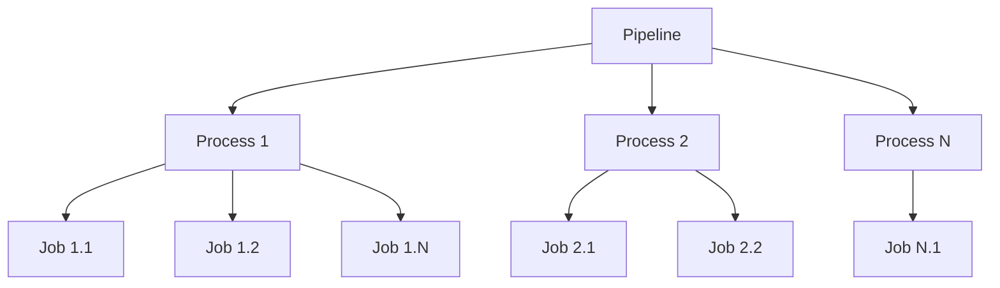
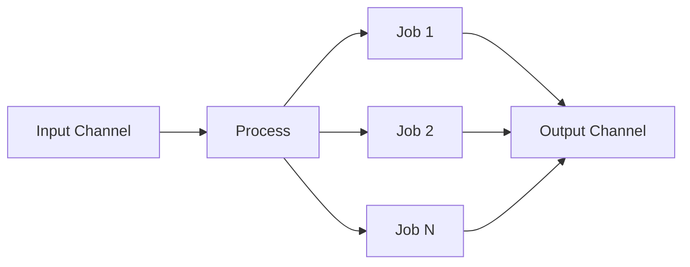
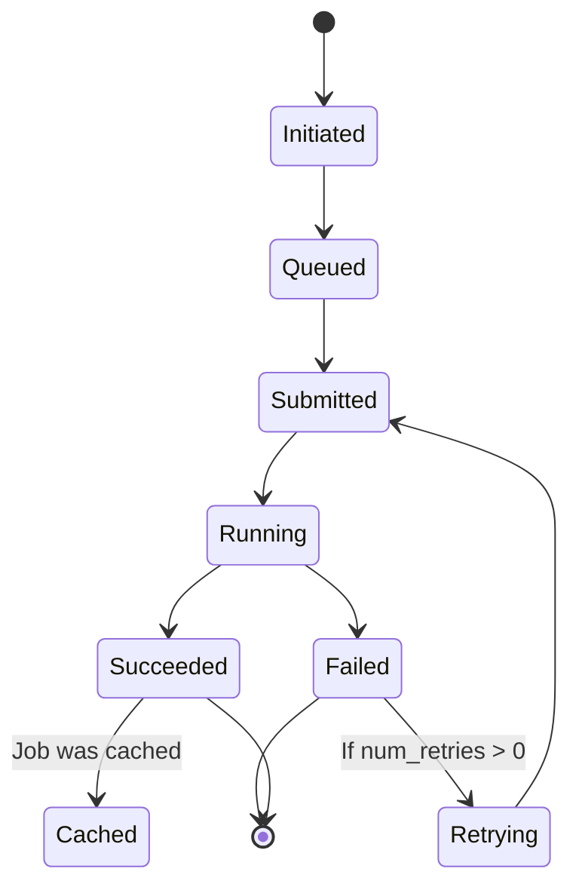
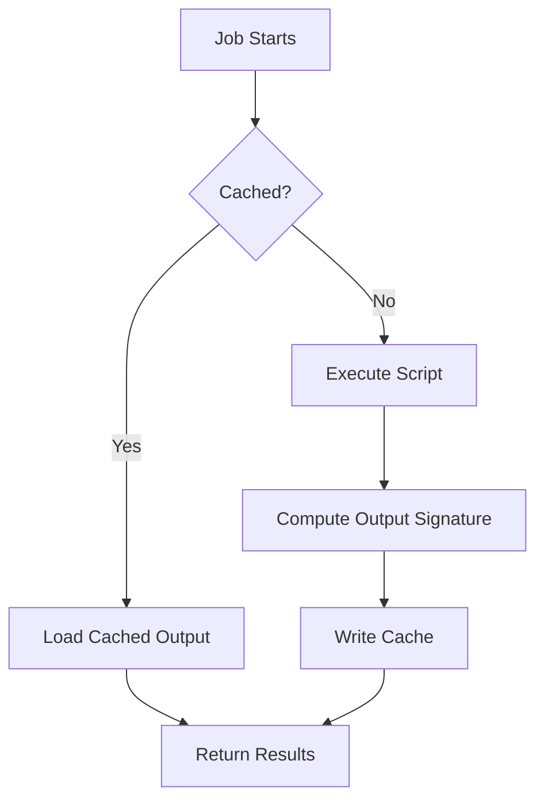
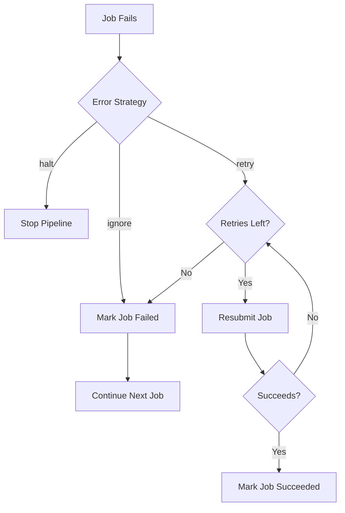

# Architecture

This document explains the internal architecture of pipen, including how pipelines execute, how data flows through channels, the plugin system, caching mechanism, and template engine.

## Overview

pipen is built on a layered architecture with three main components:

1. **Pipeline Layer**: Orchestrates the overall workflow
2. **Process Layer**: Defines individual computational steps
3. **Job Layer**: Executes individual tasks



## Pipeline Execution Flow

### 1. Initialization

When a pipeline is created, the following sequence occurs:

```python
# Pipeline creation
pipeline = Pipen(name="MyPipeline", starts=[Proc1, Proc2])

# Triggers plugin hooks:
# 1. on_setup() - Called once when first pipeline is loaded
# 2. on_init() - Called for each pipeline initialization
```

### 2. Dependency Resolution

pipen automatically infers process dependencies based on the `requires` attribute:

```python
class P1(Proc):
    """First process"""
    pass

class P2(Proc):
    """Second process"""
    requires = P1  # P2 depends on P1's output
```

The pipeline builds a directed acyclic graph (DAG) of processes and validates that:
- No circular dependencies exist
- All dependencies are satisfied
- Processes can be topologically sorted

### 3. Input Data Computation

For each process, pipen computes the input channel:

```python
# Plugin hook called
await plugin.on_proc_input_computed(proc)
```

The input channel is built from:
- `input_data` attribute (static data)
- Output channel from required processes
- Transformed input via custom functions

### 4. Job Generation

For each row in the input channel, pipen creates a job:



Each job receives:
- A subset of input data (one row from the channel)
- A working directory
- A script template to execute

### 5. Script Rendering

The process script template is rendered with job-specific data:

```python
# Plugin hook called
await plugin.on_proc_script_computed(proc)
```

Template variables include:
- `in.*`: Input variables and their values
- `out.*`: Output variable placeholders
- `proc.*`: Process metadata
- `envs`: Environment variables (options, not shell Environment Variables) that are shared across all jobs of the process

### 6. Job Submission and Execution

Jobs are submitted to the configured scheduler:

```python
# Built-in schedulers:
# - Local: Execute jobs on the local machine
# - SGE: Submit to Sun Grid Engine
# - SLURM: Submit to SLURM workload manager
# - SSH: Execute jobs on remote servers
# - Container: Run jobs in containers
# - Gbatch: Submit to Google Cloud Batch
```

Job lifecycle:



### 7. Output Collection

When a job completes:
- Output files are collected
- Output signature is computed
- Results are added to the output channel

### 8. Pipeline Completion

After all jobs complete:

```python
# Plugin hook called
await plugin.on_complete(pipeline, succeeded)
```

The pipeline:
- Reports final status
- Generates output summary
- Cleans up temporary resources

## Channel Data Flow

Channels are pandas DataFrames that structure data flow between processes.

### Channel Structure

```python
# A channel with 3 rows and 2 columns
import pandas as pd
from pipen import Channel

df = pd.DataFrame({
    'file': ['data1.txt', 'data2.txt', 'data3.txt'],
    'sample': ['sample1', 'sample2', 'sample3']
})

channel = Channel.create(df)
```

### Row-Based Parallelism

Each row in a channel becomes an independent job:

```python
# Input channel:
#    file        sample
# 0  data1.txt   sample1
# 1  data2.txt   sample2
# 2  data3.txt   sample3

# Generates 3 jobs, each with:
# Job 1: in.file = "data1.txt", in.sample = "sample1"
# Job 2: in.file = "data2.txt", in.sample = "sample2"
# Job 3: in.file = "data3.txt", in.sample = "sample3"
```

### Channel Operations

#### Creating Channels

```python
# From list
Channel.create([1, 2, 3])  # 3 rows, 1 column

# From glob pattern
Channel.from_glob("data/*.txt", sortby="mtime")

# From existing DataFrame
Channel.create(my_dataframe)
```

#### Transforming Channels

```python
# Expand directory to files
expanded = channel.expand_dir('file')

# Collapse files to directory
collapsed = channel.collapse_files('file')

# Select columns
selected = channel[['file', 'sample']]

# Filter rows
filtered = channel[channel['type'] == 'A']
```

### Channel Data Types

pipen supports several input/output types:

| Type | Syntax | Description |
|-------|---------|-------------|
| `var` | `input = "name"` | In-memory variable |
| `file` | `input = "name:file"` | Single file path |
| `dir` | `input = "name:dir"` | Single directory path |
| `files` | `input = "name:files"` | Multiple file paths |
| `dirs` | `input = "name:dirs"` | Multiple directory paths |

## Plugin System

pipen uses the [simplug](https://github.com/pwwang/simplug) library for a flexible plugin system with hook-based extensibility.

### Plugin Hooks

#### Pipeline-Level Hooks

```python
@plugin.spec
def on_setup(pipen: Pipen) -> None:
    """Called once when first pipeline is loaded.
    Use this to set default configurations.
    """

@plugin.spec
async def on_init(pipen: Pipen) -> None:
    """Called when a pipeline is initialized.
    Use this to access pipeline configuration.
    """

@plugin.spec
async def on_start(pipen: Pipen) -> None:
    """Called right before pipeline starts.
    Process relationships are already inferred.
    """

@plugin.spec
async def on_complete(pipen: Pipen, succeeded: bool) -> None:
    """Called when pipeline finishes.
    succeeded indicates whether pipeline succeeded.
    """
```

#### Process-Level Hooks

```python
@plugin.spec
def on_proc_create(proc: Proc) -> None:
    """Called when a process is created.
    Use this to modify default attributes.
    """

@plugin.spec
async def on_proc_input_computed(proc: Proc) -> None:
    """Called after process input data is computed.
    Use this to transform input data.
    """

@plugin.spec
async def on_proc_script_computed(proc: Proc) -> None:
    """Called after process script is computed.
    Use this to modify the script template.
    """

@plugin.spec
async def on_proc_start(proc: Proc) -> None:
    """Called when a process starts running.
    """

@plugin.spec
async def on_proc_end(proc: Proc, succeeded: bool) -> None:
    """Called when a process finishes.
    succeeded indicates whether process succeeded.
    """
```

#### Job-Level Hooks

```python
@plugin.spec
async def on_job_init(job: Job) -> None:
    """Called when a job is created.
    """

@plugin.spec
async def on_job_submitted(job: Job) -> None:
    """Called when a job is submitted to scheduler.
    """

@plugin.spec
async def on_job_running(job: Job) -> None:
    """Called when a job starts running.
    """

@plugin.spec
async def on_job_succeeded(job: Job) -> None:
    """Called when a job succeeds.
    """

@plugin.spec
async def on_job_failed(job: Job, error: Exception) -> None:
    """Called when a job fails.
    error contains the exception.
    """
```

### Creating a Plugin

```python
# myplugin/__init__.py
from pipen.pluginmgr import plugin

@plugin.impl
def on_proc_create(proc):
    """Modify process attributes on creation."""
    proc.config.forks = 4  # Set default to 4 parallel jobs

# In pyproject.toml:
# [tool.poetry.plugins."pipen"]
# myplugin = "myplugin:main"
```

## Caching Mechanism

pipen implements intelligent job caching to avoid redundant computations.

### Cache Key Computation

The cache key (signature) is computed from:

1. **Input data**: File paths, directory paths, or in-memory values
2. **Script content**: Hash of the rendered script
3. **Process metadata**: Configuration values that affect output

```python
# Signature file location
{workdir}/{proc.name}/{job.index}/job.signature.toml

# Example signature:
[signature]
input_hash = "a1b2c3d4..."
script_hash = "e5f6g7h8..."
config_hash = "i9j0k1l2..."
```

### Cache Check Process

When a job starts:



### Cache Invalidation

A cache is invalid if:

1. Input files are modified (based on modification time)
2. Script content changes
3. Process configuration changes
4. Output files are missing or corrupted

### Directory Signatures

pipen supports directory-level signatures (`dirsig`):

```python
# If dirsig is set:
# - Cache considers all files in the directory
# - Any file modification invalidates cache
# - Useful for directory outputs with multiple files

proc.dirsig = 1  # Enable directory signature
```

## Template Engine

pipen uses template engines to render job scripts dynamically.

### Supported Template Engines

1. **Liquid** (default): Safe, production-ready templating
2. **Jinja2**: Feature-rich Python templating
3. **Mako**: High-performance Python templating

### Template Variables

Inside a script template, you have access to:

```python
# Input variables
{{ in.input_file }}      # Value of 'input_file' input
{{ in.config_value }}   # Value of 'config_value' input

# Output placeholders
{{ out.output_file }}    # Where to save output

# Process metadata
{{ proc.name }}          # Process name
{{ proc.workdir }}       # Process workdir
{{ proc.index }}         # Job index

# Template options (defined in proc.envs)
# Note: These are NOT shell environment variables like PATH or HOME
# They are custom options passed to template rendering context
{{ envs.* }}
```

### Example Templates

#### Bash Template

```python
script = """
# Process {{ in.input_file }}
cat {{ in.input_file }} > {{ out.output_file }}

# Report progress
echo "Processed: {{ in.input_file }}"
"""
```

#### Python Template

```python
lang = "python"
script = """
import pandas as pd

# Read input
df = pd.read_csv('{{ in.input_file }}')

# Process data
df['processed'] = df['value'] * 2

# Save output
df.to_csv('{{ out.output_file }}', index=False)
"""
```

#### Using Filters

```python
# Built-in filters
{{ in.path | basename }}   # Get filename from path
{{ in.path | dirname }}    # Get directory from path
{{ in.value | upper }}     # Convert to uppercase
```

#### Using Template Options (proc.envs)

```python
# Define template options in process
class MyProc(Proc):
    envs = {
        "custom_var": "my_value",
        "threshold": 100
    }
    script = """
    echo "Custom value: {{ envs.custom_var }}"
    echo "Threshold: {{ envs.threshold }}"
    """

# Note: envs are NOT shell environment variables (PATH, HOME, etc.)
# They are custom options passed to the template rendering context
```

## Scheduler Architecture

pipen supports multiple schedulers through a unified interface.

### Scheduler Interface

All schedulers implement the `xqute.Scheduler` interface:

```python
class Scheduler(ABC):
    """Base class for schedulers"""

    async def submit(self, job: Job) -> None:
        """Submit a job for execution"""

    async def kill(self, job: Job) -> None:
        """Kill a running job"""

    async def poll(self, job: Job) -> JobStatus:
        """Check job status"""

    async def clean(self, job: Job) -> None:
        """Clean up job resources"""
```

### Scheduler Selection

```python
# Via configuration
pipeline = Pipen(scheduler="local")     # Local execution
pipeline = Pipen(scheduler="sge")       # Sun Grid Engine
pipeline = Pipen(scheduler="slurm")     # SLURM
pipeline = Pipen(scheduler="gbatch")     # Google Cloud Batch

# Via profile
# .pipen.toml:
# [default]
# scheduler = "slurm"
```

### Custom Schedulers

To create a custom scheduler:

```python
# myscheduler.py
from xqute import Scheduler, JobStatus

class MyScheduler(Scheduler):
    """Custom scheduler implementation"""

    async def submit(self, job) -> None:
        # Submit job to your system
        pass

    async def poll(self, job) -> JobStatus:
        # Check job status
        return JobStatus.RUNNING
```

## Error Handling

pipen provides multiple error handling strategies:

### Error Strategies

```python
# ignore: Continue with next job (default)
pipeline = Pipen(error_strategy="ignore")

# halt: Stop the entire pipeline
pipeline = Pipen(error_strategy="halt")

# retry: Retry failed jobs
pipeline = Pipen(error_strategy="retry")
```

### Error Propagation



### Custom Error Handling

```python
class MyProc(Proc):
    """Process with custom error handling"""

    input = "data"
    output = "result:file"

    script = """
    python process.py {{ in.data }} {{ out.result }}
    """

    # Custom error handling in script
    # Check exit code and handle accordingly
```

## Performance Considerations

### Parallel Execution

```python
# Forks: Number of concurrent jobs
pipeline = Pipen(forks=4)  # Run 4 jobs in parallel

# Submission batch: Jobs to submit at once
pipeline = Pipen(submission_batch=8)  # Submit 8 jobs per batch
```

### Memory Management

- Each job runs in its own directory
- Output files are cleaned up after processing
- Cache files are stored in workdir

### I/O Optimization

```python
# Use cloud storage caching
export CLOUDPATHLIB_LOCAL_CACHE_DIR=/path/to/cache

# Enable directory signatures for large outputs
proc.dirsig = 1

# Use appropriate scheduler for workload
# Local: Small jobs, rapid iteration
# SLURM/SGE: Large compute jobs
# Gbatch: Cloud-scale processing
```

## Further Reading

- [Basics](basics.md) - Pipeline layers and folder structure
- [Channels](channels.md) - Data flow between processes
- [Configuration](configurations.md) - Pipeline and process configuration
- [Plugins](plugin.md) - Plugin development guide
- [Scheduler](scheduler.md) - Scheduler backends
