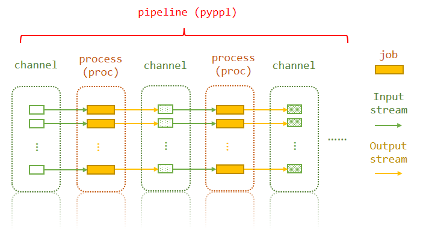

<!-- toc -->

# Layers of a pipeline

The pipeline consists of channels and processes. A process may have many jobs. Each job uses the corresponding elements from the input channel of the process, and generates values for output channel.
Actually, what you need to do is just specify the first input channel, and then tell `PyPPL` the dependencies of the processes. The later processes will use the output channel of the processes they depend on. Of course, you can interfere by using functions in the input specification.

# Folder structure
```
./
|- pipeline.py
`- workdir/
   `- PyPPL.<id>.<tag>.<suffix>/
      |- proc.lock
      |- proc.settings.yaml
      `- <job.index>/
         |- input/
         |- output/
            `- .jobcache
         |- job.cache
         |- job.script
         |- job.pid
         |- job.rc
         |- job.stdout
         |- job.stderr
         `- <job.script.wrapper>
```

| Path | Content | Memo |
|------|---------|------|
|`workdir/`|Where the pipeline directories of all processes of current pipeline are located.|Can be set by `p.ppldir`|
|`PyPPL.<id>.<tag>.<suffix>/`|The work directory of current process.|The `suffix` is a unique identify of the process according to its configuration.<br/>You may set it by `p.workdir`|
|`proc.settings.yaml`|The settings of the process|Part of proc settings, used for resuming the process|
|`<job.index>/`|The job directory|Starts with `1`|
|`<job.index>/input/`|Where you can find the links to all the input files||
|`<job.index>/output/`|Where you can find all the output files||
|`<job.index>/job.cache`|The file containing the signature of the job||
|`<job.index>/job.script`|To script file to be running||
|`<job.index>/job.pid`|The id of the job of its running system.|Mostly used to tell whether the process is still running.|
|`<job.index>/job.rc`|To file containing the return code||
|`<job.index>/job.stdout`|The STDOUT of the script||
|`<job.index>/job.stderr`|The STDERR of the script||
|`<job.index>/<job.script.wrapper>`|The wrapper for jobs to run|Used to dump the stdout, stderr and the return code.|

!!! note
    You are encouraged to set `p.ppldir` **BUT NOT** `p.workdir`, as it contains a unique `suffix` that is automatically computed.

# Symbols used in this documentation
* `<workdir>` refers to `./workdir/PyPPL.<id>.<tag>.<suffix>/`,
* `<indir>` refers to `./workdir/PyPPL.<id>.<tag>.<suffix>/<job.index>/input/`
* `<outdir>` refers to `./workdir/PyPPL.<id>.<tag>.<suffix>/<job.index>/output/`
* `pXXX` or `p` refers to a process instantiated from `pyppl.Proc` class.
