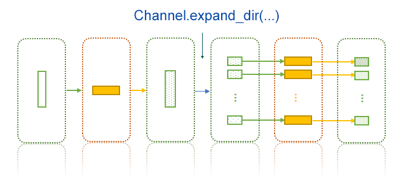
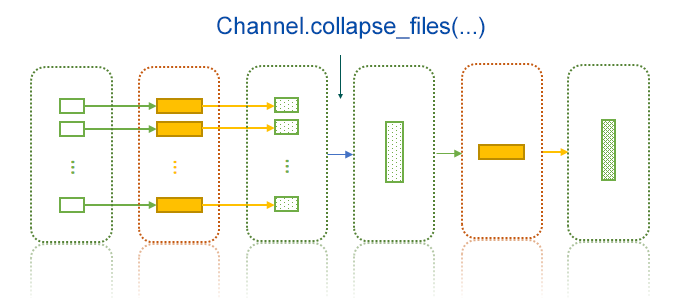

Channels are used to pass data from one process to another. It is actually a `pandas.DataFrame` object, where each column corresponds to an input key and each row corresponds to a job.


The values for different variables in different jobs wil be:

| Job Index | v1 | v2  | v3 |
|-----------|----|-----|----|
| 0         | a1 | b1  | c1 |
| 1         | a2 | b2  | c2 |
| ...       |... | ... |... |

With a process definition:

```python
class MyProcess(Proc):
    input = "v1, v2, v3"
    input_data = df #  The above data frame
```

Then:

|Job index|Template|Rendered to|
|0|`{{in.v1}}`|`a1`|
|0|`{{in.v2}}`|`b1`|
|0|`{{in.v3}}`|`c1`|
|1|`{{in.v1}}`|`a2`|
|1|`{{in.v2}}`|`b2`|
|1|`{{in.v3}}`|`c2`|
|...|...|...|

The column names don't have to match the exact input keys. If `pipen` finds any of the input keys present in the data, just use them. However, if any input keys cannot find in the data frame, we will use the first couple of columns.

For example:
```python
class MyProcess2(Proc):
    input = "v4, v3"
    input_data = df #  The above data frame
```

The for job#0, `{{in.v4}}` will be rendered as `a1` (using column `v1` in the data), and `{{in.v3}}` as `c1` (using column `v3`).


## Creating channels

Since channels are just data frames, so whatever creates a pandas data frame, can be used to create a channel. Besides, a couple of class methods are avaible to create channels:

- `Channel.create(...)`

    This takes a list of values to create a channel. If a data frame is passed, will return that data frame.

    If each element in the list is a tuple, the list is used to create a data frame directly, just like:

    ```python
    from pandas import DataFrame
    ch = Channel.create([(1,2), (3,4)])
    # ch = DataFrame([(1,2), (3,4)])
    #         0       1
    #   <int64> <int64>
    # 0       1       2
    # 1       3       4
    ```

    If each element is not a tuple (even it is a list), it is converted to tuple:
    ```python
    ch = Channel.create([1, 2])
    # equvalent to:
    # ch = Channel.create([(1, ), (2, )])
    ```

    The `input_data` is passed to this class method to create the input channel.

- `Channel.from_glob(...)`

    This takes a glob pattern to match the files to create a single-column channel.

    You can also filter the types of files by `ftype`:
    - `any`: to match any files (default)
    - `link`: to mach any links
    - `dir`: to match any directories
    - `file`: to match any files

    You may also sort the files using `sortby`:
    - `name`: sort the files by their basename (default)
    - `mtime`: sort the files by their last modified time
    - `size`: sort by file size

    When `reverse` is True, the above sortings are reversed.

- `Channel.from_pairs(...)`

    Like `Channel.from_glob()` but create a double-column channel.

- `Channel.from_csv(...)`

    Uses `pandas.read_csv()` to create a channel

- `Channel.from_excel(...)`

    Uses `pandas.read_excel()` to create a channel

- `Channel.from_table(...)`

    Uses `pandas.read_table()` to create a channel


## Builtin verbs/functions to transform channels

`pipen` uses [`pipda`][1] to create some verbs/functions to transform channels, so that you can use them with piping syntax:

```python
channel >> verb(...)
```

### Expanding a channel by directory: `expand_dir()`

Sometimes we prepare files in one process (for example, split a big file into small ones in a directory), then handle these files by different jobs in another process, so that they can be processed simultaneously.



For example:
```python

class P1(Proc):
    # the original file: a.txt
    input  = "infile:file"
    input_data = ["a.txt"]
    output = "outdir:dir:outdir"
    script = "# the script to split a.txt to 1.txt, 2.txt, 3.txt ... to {{out.outdir}}"

class P2(Proc):
    requires = P1
    # expand channel [("outdir/a/",)] to channel:
    # [("outdir/a/1.txt",), ("outdir/a/2.txt",), ("outdir/a/3.txt",), ...]
    input = "infile:file"
    input_data = lambda ch: ch >> expand_dir(pattern="*.txt")
    # outfile: 1.result, 2.result, ...
    output  = "outfile:file:{{in.infile.split('/')[-1].split('.')[0]}}.result"
    script  = """
    # work on {{in.infile}} (1.txt, 2.txt, 3.txt, ...)
    # to result file {{out.outfile}} (1.result, 2.result, 3.result, ...)
    """

# Run 3 jobs in a batch simultaneously
Pipen(forks=3).run(P1)
```

If the channel is a multi-column channel, you can also specify `col` to expand only on that column, values of other columns will be copied to the expanded rows/jobs.

You can also filter and sort the expanded files using arguments `ftype`, `sortby` and `reverse`, just like when we use `Channel.from_glob(...)`

!!! caution

    - `expand_dir(...)` only works for single-row channels, which will be expanded to `N` (number of files included). If original channel has more than 1 row, only first row will be used, and other rows will be ignored.
    - Only the value of the column to be expanded will be changed, values of other columns remain the same.

### Collapsing a channel by files in a common ancestor directory: `collapse_files(...)`

It's basically the reverse process of `expand_dir()`. It applies when you deal with different files and in next process you need them all involved (i.e. combine the results):



For example:
```python

class P1(Proc):
    input = "infile:file"
    input_data = ["/a/b/1.txt", "/a/b/2.txt", "/a/b/3.txt"]
    output = "outfile:file:{{in.infile.split('/')[-1].split('.')[0] | append: '.txt2'}}"
    script = """
    # the script to deal with each input file:
    # {{in.infile}} -> {{out.outfile}}
    """

class P2(Proc):
    requires = P1
    # collapse channel [("<outdir>/1.txt2",), ("<outdir>/2.txt2",), ("<outdir>/3.txt2",)]
    # to channel: [("<outdir>/", )]
    input   = "indir:file"
    input_data = lambda ch: ch >> collapse_files()
    output  = "outfile:file:{{in.indir.split('/')[-1]}}.result"
    script  = """
    # combine 1.txt2, 2.txt2, 3.txt3 in {{in.indir}} to {{out.outfile}}
    """

Pipen().run(P1)
```

Similarly, if we have multiple columns, you may specify the column by index or name to collapse by:
`ch >> collapse_files(col=...)`

!!! caution

    * `os.path.dirname(os.path.commonprefix(...))` is used to detect the common ancestor directory, so the files could be `['/a/1/1.file', '/a/2/1.file']`. In this case `/a/` will be returned.
    * values at other columns should be the same. They will NOT be checked! The values at the first row will be used.

[1]: https://github.com/pwwang/pipda
