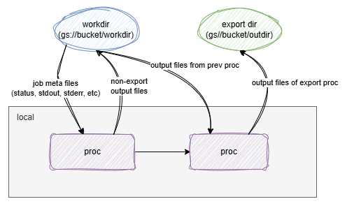

Since `v0.16.0`, `pipen` supports the cloud naively. There are two ways by means of cloud support:

- Run the pipeline locally (or schedulers like `sge`, `slurm`, etc.) and save the files to the cloud.
- Run the pipeline on the cloud.

## Run the pipeline locally and save the files to the cloud

To run the pipeline locally and save the files to the cloud, you need to install `pipen` with cloud support:

```bash
pip install xqute[cloudsh]
# To support a specific cloud service provider
pip install cloudpathlib[s3]
pip install cloudpathlib[gs]
pip install cloudpathlib[azure]
```

The you can directly assign a cloud path as a pipeline working directory:

```python
from pipen import Pipen, Proc, run


class P1(Proc):
    """Sort input file"""
    input = "in:var"
    input_data = ["Hello World"]
    output = "outfile:file:out.txt"
    # Note that out.outfile is on the cloud but the script is executed locally
    # we can use cloudsh to save the output to the cloud
    script = "echo {{in.in}} | cloudsh sink {{out.outfile}}"


class MyPipeline(Pipen):
    starts = P1
    workdir = "gs://mybucket/mypipeline/workdir"
    output = "gs://mybucket/mypipeline/output"


if __name__ == "__main__":
    MyPipeline().run()
```

Like the following figure, the pipeline is run locally but the meta information is grabbed from and saved to the cloud (workdir).
No local files are generated.

For the output files, if a process is a non-export process, the output files are saved to the workdir.
If a process is an export process, the output files are saved to the output directory (export dir).



## Run the pipeline on the cloud

Currently, `pipen` only supports running the pipeline on the cloud with google batch jobs.

To run the pipeline on the cloud, you need to install `pipen` with cloud support:

```bash
pip install xqute[gs]
```

It is used to communicate with google cloud storage files. No `cloudsh` is needed, since operating the cloud files will be happening on the cloud (with the cloud paths mounted to the VM). You also need to have [google cloud sdk][1] installed and configured, which is used to communicate with google batch jobs (submit jobs, get job status, etc.).

```python
from pipen import Pipen, Proc, run


class P1(Proc):
    """Sort input file"""
    input = "in:var"
    input_data = ["Hello World"]
    output = "outfile:file:out.txt"
    # Note that out.outfile is on the cloud but the script is executed locally
    # we can use cloudsh to save the output to the cloud
    script = "echo {{in.in}} | cloudsh sink {{out.outfile}}"


class MyPipeline(Pipen):
    starts = P1
    workdir = "gs://mybucket/mypipeline/workdir"
    output = "gs://mybucket/mypipeline/output"
    scheduler = "gbatch"


if __name__ == "__main__":
    MyPipeline().run()
```

The only difference is that we need to set `scheduler` to `gbatch` (google batch jobs).

As shown in the following figure, the pipeline is run on the cloud platform, and the workdir and export dir will be mounted to the VM. So the process script can directly access the cloud files, no `cloudsh` or `gcloud` tools are needed.


!!! tip

    While the workdir and output dir are on the cloud, `pipen` needs to communicate with the cloud storage to get and save the meta information of the pipeline (workdir) and also upload/download files if needed. We are using [`yunpath`][2] to manage the cloud paths, which is a wrapper of [`cloudpathlib`][3]. `cloudpathlib` uses a cache mechanism to reduce the communication with the cloud storage, which can greatly improve the performance. If you are running into issues with the local cache (e.g. no space left), you can set the environment variable `CLOUDPATHLIB_LOCAL_CACHE_DIR` to change the cache directory. See more details in the [`cloudpathlib` documentation][4].


[1]: https://cloud.google.com/sdk?hl=en
[2]: https://github.com/pwwang/yunpath
[3]: https://github.com/drivendataorg/cloudpathlib
[4]: https://cloudpathlib.drivendata.org/stable/caching/
