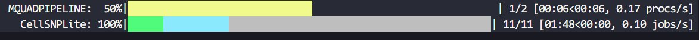
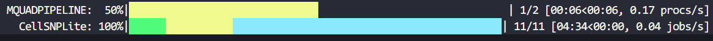

## Creating a `Pipen` object

The arguments for the constrctor are:

- `name`: The name of the pipeline
- `desc`: The description of the pipeline
- `outdir`: The output directory of the pipeline. If not provided, defaults to `<pipeline-name>_results`.
- `**kwargs`: Other configurations

## Specification of the start processes

Once the requirements of the processes are specified, we are able to build the entire process dependency network. To start runing a pipeline, we just need to specify the start processes to start:

```python
class P1(Proc):
    ...

class P2(Proc):
    ...

class P3(Proc):
    requires = [P1, P2]
    ...

Pipen().set_starts(P1, P2)
```

You can specify the start processes individually, like we did above, or send a list of processes:

```python
Pipen().set_starts([P1, P2])
```

## Setting input data for start processes

Other than set the input data when defining a process, you can also specify the input data for start processes:

```python
Pipen().set_starts(P1, P2).set_data(<data for P1>, <data for P2>)
```

This is useful when you want to reuse the processes.

The order of data in `.set_data()` has to be the same as the order of processes to be set in `.set_starts()`. When the `input_data` of a start process has already been set, an error will be raised. To use that `input_data`, use `None` in `.set_data()`. For example:

```python
class P1(Proc):
    ...

class P2(Proc):
    input_data = [1]

Pipen().set_starts(P1, P2).set_data(<data for P1>, None)
```

## Running with a different profile

`Pipen.run()` accepts an argument `profile`, which allows you to use different profile from configuration files to run the pipeline:

```python
Pipen().run("sge")
```

See [configurations][1] for more details.

## Shortcut for running a pipeline

```python
import pipen

class P1(pipen.Proc):
    ...

class P2(pipen.Proc):
    ...

class P3(pipen.Proc):
    requires = [P1, P2]
    ...

pipen.run("MyPipeline", starts=[P1, P2], data=[<data for P1>, <data for P2>])
```

```python
>>> help(pipen.run)

run(
    name: 'str',
    starts: 'Type[Proc] | List[Type[Proc]]',
    data: 'Iterable' = None,
    *,
    desc: 'str' = None,
    outdir: 'str | PathLike' = None,
    profile: 'str' = 'default',
    **kwargs,
) -> 'bool'
    Shortcut to run a pipeline

    Args:
        name: The name of the pipeline
        starts: The start processes
        data: The input data for the start processes
        desc: The description of the pipeline
        outdir: The output directory of the results
        profile: The profile to use
        **kwargs: Other options pass to Pipen to create the pipeline

    Returns:
        True if the pipeline ends successfully else False
```

## Progress bars

When running a pipeline, a progress bar will be shown in the console to indicate the progress of the pipeline. You will see two progress bars: one for the overall progress of the pipeline (running processes vs total processes), and one for the current running process (prepared/running/failed/succeeded/cached jobs vs total jobs).



The above progress bars indicate that the pipeline has 2 processes in total, and 1 process is currently running. The running process has 11 jobs in total, and all jobs are prepared, where none of them have started running, 1 has succeeded/cached, and 2 are submitted.



And the above progress bars indicate that the running process has 11 jobs in total, and 1 jobs have succeeded/cached, 2 jobs started running, and the rest are still prepared.

Colors are used to indicate different job statuses:

- <span style="color:grey;">■</span> grey: initiated
- <span style="color:lightblue;">■</span> light blue: queued (added in v1.0.3)
- <span style="color:cyan;">■</span> cyan: submitted
- <span style="color:yellow;">■</span> yellow: running
- <span style="color:green;">■</span> green: succeeded/cached
- <span style="color:red;">■</span> red: failed

Since v1.0.0, the progress bars also show the number of jobs in different statuses:

- I: initiated
- Q: queued (added in v1.0.3)
- S: submitted
- R: running
- D: succeeded/cached | failed

For single-job processes, the job progress bar will be simplified to show the status of the job directly.


[1]: configurations.md
